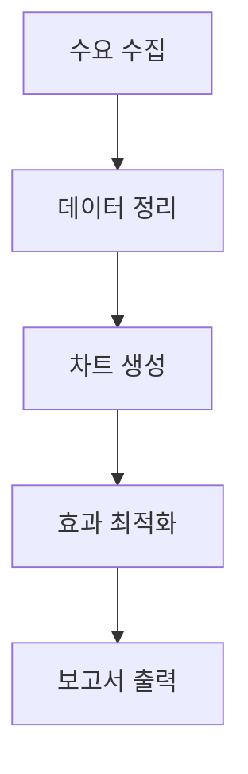
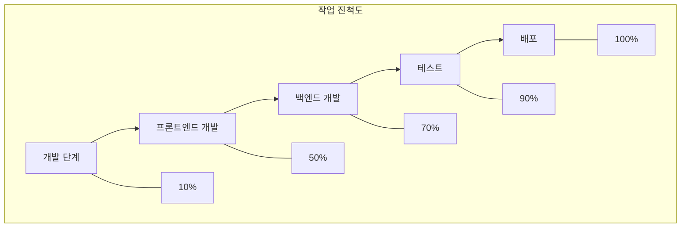

데이터 처리 및 시각화 환경에서 표 데이터를 직관적인 차트로 전환하는 것은 정보 전달 효율을 높이는 핵심 단계입니다. 프로젝트 관리의 작업 진척도 표, 데이터 분석의 통계 결과, 기술 문서의 프로세스 설명과 같이 "표 데이터"를 더 가독성 있고 시각적으로 강조해야 할 때, `graph td` 형식을 지원하는 차트 생성 도구는 매우 중요합니다. 이러한 도구는 수동 레이아웃 조정이나 형식 변환 과정을 생략해 데이터를 "정적 표"에서 "동적 차트"로 전환하여 복잡한 정보를 명확하게 전달합니다.

### 왜 전용 "표 데이터로 차트 생성" 도구가 필요한가요?

기존 방식에서는 사용자가 Excel로 차트를 삽입하거나, PPT로 그래픽을 그려보거나, Google Charts 같은 온라인 도구를 사용해 수동으로 데이터를 변환하려고 시도하지만, 이러한 방법은 다음과 같은 한계를 가집니다:

- **수동 조작 복잡성**: Excel로 차트 생성 시 데이터 영역 재설정, 차트 유형 선택, 스타일 설정 등 반복 작업이 필요해 시간이 많이 소요되고 오류가 발생하기 쉬움;
- **형식 호환성 낮음**: 표 데이터에 중첩 표나 다중 레벨 td 정의 등 특수 구조가 포함된 경우, 기존 도구가 지능적으로 인식해 시각화 차트로 변환하기 어렵음;
- **실시간 반영 불가**: 표 데이터를 수정할 때마다 차트 효과를 즉시 미리 볼 수 없어 최종 결과가 예상과 달라짐.

반면, "표 데이터로 차트 생성"을 전문적으로 지원하는 도구는 주로 구조화된 문법(예: mermaid의 프로세스 차트 문법)을 기반으로 하여 `graph td`와 같은 표 기술을 차트로 직접 변환해 "문법이 차트"로 이어지는 효율적인 전환을 가능하게 합니다.

### 추천 도구: mermaid-live-editor, `graph td` 데이터로 차트 생성 간편화

표 데이터를 차트로 변환하는 도구 중에서 **mermaid-live-editor** ([https://tools.cmdragon.cn/apps/mermaid-live-editor](https://tools.cmdragon.cn/apps/mermaid-live-editor))는 `graph td` 문법 원본 지원, 실시간 편집 미리보기, 다중 형식 내보내기 기능으로 표 데이터를 차트로 변환하는 최적의 도구입니다. 주요 강점은 다음과 같습니다.

#### 1. `graph td` 문법 지원으로 표 데이터 정확한 매핑

`graph td`는 mermaid 문법에서 **가로 프로세스 표**를 정의하는 핵심 구조로, 순서 관계가 있는 프로세스(예: 간트 차트, 작업 할당표, 단계 프로세스 차트)를 설명하는 데 자주 사용됩니다. mermaid-live-editor에 `graph td`를 포함한 표 데이터를 입력하기만 하면 자동으로 시각화 차트가 생성됩니다. 예를 들어 다음 `graph td` 코드를 입력하면:

도구가 즉시 가로 프로세스 차트로 렌더링합니다. 표의 각 노드(A, B, C 등)는 차트의 사각형 박스로 자동 매핑되고, 화살표는 단계 순서를 나타내어 데이터 관계를 직관적으로 보여줍니다. 수동으로 프로세스 차트를 그리는 것보다 시간을 크게 절약하며, 특히 기술 문서, 프로젝트 관리 등 프로세스를 신속하게 정리해야 하는 분야에 적합합니다.

#### 2. 실시간 편집 + 다중 형식 내보내기로 다각도 활용

mermaid-live-editor는 **온라인 설치 없이 사용 가능한 도구**로, 링크를 열면 바로 사용 가능하며 환경 설정이 필요 없습니다. 왼쪽 입력창에서 `graph td` 또는 다른 mermaid 문법(예: `flowchart`, `gantt`, `pie` 차트)을 작성하면 오른쪽 실시간 미리보기 영역에서 차트 효과가 즉시 업데이트됩니다. 또한 **드래그로 노드 순서 조정**, **스타일 수정(색상, 폰트, 화살표)** 등 개별 설정도 지원합니다.

차트 생성 후 PNG, SVG 등 다양한 형식으로 한 번 클릭으로 내보내기 가능해 Word, PPT, Markdown 문서에 삽입하거나 블로그, 프로젝트 관리 플랫폼(예: GitHub)에 공유하는 데 편리하며, 기존 도구의 "생성-내보내기-조정" 다단계 과정을 해결합니다.

#### 3. 가벼운 문법 + 학습 장벽 없음으로 빠른 적용

mermaid-live-editor의 문법 규칙은 간단하고 직관적이어서 초보자도 "노드 정의(A[내용]) + 관계 설명(-->)" + "형식 정렬(td 표)" 기초 구조만 이해하면 빠르게 시작할 수 있습니다. 예를 들어 `graph td`로 "작업 이름", "담당자", "진척도"를 포함한 표 데이터를 설명하는 예시:

이렇게 하면 작업 진척도를 표와 함께 시각적으로 표현할 수 있습니다.

### 결론

표 데이터를 프로세스 차트나 진척도표로 변환하는 데 어려움을 느낀다면, mermaid-live-editor의 실시간 미리보기 기능과 `graph td` 문법 지원으로 간편하게 전문 차트를 생성해 보세요. 수동 조작 없이 빠르게 시각화 결과를 확인하고, 다양한 형식으로 내보내어 업무 효율을 극대화할 수 있습니다. [mermaid-live-editor 바로가기](https://tools.cmdragon.cn/apps/mermaid-live-editor)에서 시작해 보세요.