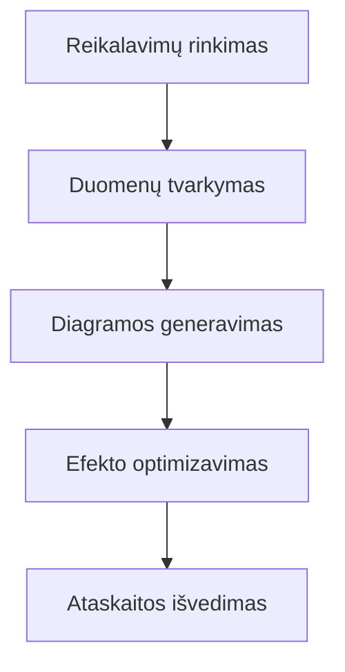

Duomenų apdorojimo ir vizualizavimo kontekste lentelės duomenų pateikimas kaip aiškios diagramos yra esminis veiksnys, pagerinant informacijos perdavimo efektyvumą. Nepriklausomai nuo to, ar tai yra užduočių pažangos lentelė projektų valdyme, statistinių rezultatų analizė arba procesų paaiškinimas techniniuose dokumentuose, kai reikia paversti "lentelės duomenis" į daug skaidresnį ir pateisinamą formą, įrankis, kuris tiesiogiai konvertuoja lentelės duomenis (ypač palaikant `graph TD` formatą), tampa neįkainojamas. Toks įrankis išvengia sudėtingų rankinių išdėstymo ir formatų konvertavimo procesų, leidžiant duomenims iš "stacionarios lentelės" tapti "dinamiška diagrama", todėl sudėtinga informacija gali būti aiškiau perteikta.

### Kodėl reikia specialaus "lentelės duomenų konvertavimo į diagramą" įrankio?

Tradiciškai vartotojai gali bandyti naudoti Excel sukurti diagramas, PPT piešti grafiką arba naudoti internetinius įrankius kaip Google Charts rankiniu būdu konvertuoti duomenis, tačiau šios metodikos dažnai turi ribotumų:

- **Sudėtinga rankinė veikla**: Excel generuojant diagramas reikia dažnai keisti duomenų sritis, pasirinkti diagramos tipą, nustatyti stilių – tai užtrunka ir lengva sukurti klaidų;
- **Blogas formatų atitikimas**: Jei lentelės duomenys turi specialią struktūrą (pvz., įdėtas lentelės, daugiau lygių `td` apibrėžimų), tradiciniai įrankiai sunkiai išmaniai identifikuoja ir konvertuoja į vizualizuotą diagramą;
- **Neužtenkama realaus laiko galimybė**: Negalima koreguoti lentelės duomenų ir tuo pačiu matyti diagramos poveikį, dėl ko galutinis pateikimas gali neatitikti lūkesčių.

Specialus "lentelės duomenų konvertavimo į diagramą" įrankis dažniausiai remiasi struktūruota sintakse (pvz., Mermaid procesų diagramos sintaksė), kuris tiesiogiai paverčia `graph TD` panašias lentelės aprašymus į diagramas, realizuodamas "sintaksė = diagrama" efektyvų konvertavimą.

### Rekomenduojamas įrankis: Mermaid Live Editor, lengvai generuojant `graph TD` duomenis į diagramas

Daugelio lentelės duomenų konvertavimo į diagramą įrankių, **Mermaid Live Editor** ([https://tools.cmdragon.cn/apps/mermaid-live-editor](https://tools.cmdragon.cn/apps/mermaid-live-editor)) dėl natūralios `graph TD` sintaksės palaikymo, realaus laiko redagavimo peržiūros ir daugiaformatio eksporto, tapo geriausiu pasirinkimu lentelės duomenų konvertavimui į diagramas. Jo pagrindiniai privalumai:

#### 1. Palaiko `graph TD` sintaksę, tiksliai atitinka lentelės duomenų generavimo poreikius

`graph TD` yra Mermaid sintaksės, naudojama apibrėžti **horizontalią procesų lentelę**, dažniausiai naudojama aprašant sekos santykius (pvz., Gantto diagrama, užduočių priskyrimo lentelė, žingsnių procesų diagrama). Vartotojas gali tiesiog įvesti `graph TD` turinį Mermaid Live Editor, ir įrankis automatiškai generuos atitinkamą vizualią diagramą. Pavyzdžiui, įveskite šią `graph TD` sintaksę:

Įrankis iš karto atvaizduos horizontalią procesų diagramą, kiekvienas mazgas (pvz., A, B, C) automatiškai atitiks diagramos stačiakampius, rodyklės rodo žingsnių seką, aiškiai pateikdamos procesą.

#### 2. Realusis laiko peržiūra ir tempimo perstumimas stilių

Mermaid Live Editor leidžia matyti diagramos poveikį iš karto koreguojant duomenis. Vartotojas gali tempėti elementus, kad pakeistų jų išdėstymą, be jokio atidėjimo.

#### 3. Daugiaformatis eksportas (PNG/SVG)

Diagramos gali būti eksportuotos į populiarius formatus, pvz., PNG ar SVG, leidžiant naudoti juos dokumentuose ar internete.

### Kodėl Mermaid Live Editor?

- **Lengva naudoti**: Nereikia mokytis sudėtingos sintaksės, veikia realiuoju laiku.
- **Profesionalus rezultatas**: Gali būti naudojama tiek pradedantiesiems, tiek profesionalams.
- **Tinkama verslo kontekste**: Tinka projektų valdymui, techniniams dokumentams, analizėms.

Naudodami Mermaid Live Editor, galite greitai paversti bet kurią lentelę į aiškią, pateisinamą procesų diagramą – vienu mygtuku. Pradėkite darbą jau šiandien!