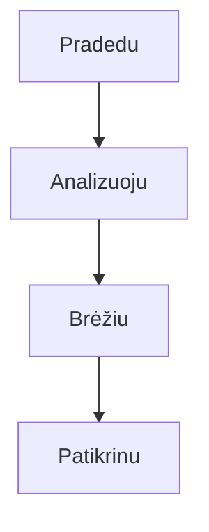

Šiandieninėje darbo ir mokymosi aplinkoje srauto diagramos yra svarbus vizualinio komunikavimo įrankis, naudojamas procesų logikos struktūravimui, sistemos architektūros rodymui arba užduočių žingsnių planavimui. Nepriklausomai nuo to, ar tai darbe projektų skaidymas, ar mokymosi žinių struktūravimas, lengvai naudojamas, be sudėtingų nustatymų diagramos įrankis gali padidinti efektyvumą.

**mermaid live editor**  
([spustelėkite čia](https://tools.cmdragon.cn/apps/mermaid-live-editor): https://tools.cmdragon.cn/apps/mermaid-live-editor) yra toks internetinis diagramų brėžimo įrankis, kuris savo lengvumu, realiuoju laiku ir sintaksės valdymu leidžia net pradedantiesiems greitai brėžti profesionalias srauto diagramas.

### 1. Kodėl pasirinkti **mermaid live editor**?

Palyginti su tradiciniais diagramų programiniais (pvz., Visio, Draw.io), **mermaid live editor** turi reikšmingų pranašumų:

- **Nereikia instaliuoti**: tiesiogiai naudojama per naršyklę, suderinama su Windows, Mac, Linux ir kitomis sistemomis.
- **Sintaksės valdomas, logiškas**: diagrama aprašoma panašiai į kodą, matote rezultatą iš karto, kai keičiate sintaksę.
- **Lengvas bendradarbiavimas**: generuojamas grafinis kodas gali būti tiesiogiai dalinamas arba eksportuojamas į paveikslėlius/Markdown, patogu dokumentuose ir susitikimuose.
- **Visų scenarijų palaikymas**: galima brėžti ne tik srauto diagramas, bet ir sekos diagramas, Ganto diagramas, būsenos diagramas, minties žemėlapius, atitinkantį įvairias poreikius.

Jei ieškote „internetinio, lengvo, funkcionalaus“ diagramų įrankio, tiesiog atidarykite **mermaid live editor**  
([https://tools.cmdragon.cn/apps/mermaid-live-editor](https://tools.cmdragon.cn/apps/mermaid-live-editor)) ir pabandykite.

### 2. **mermaid live editor** naudojimo visos eigos žinynas

#### 1. Greitas pradžia: įrankio atidarymas ir sąvokų supratimas

**Pirmasis žingsnis**: spustelėkite **mermaid live editor** nuorodą ([https://tools.cmdragon.cn/apps/mermaid-live-editor](https://tools.cmdragon.cn/apps/mermaid-live-editor)), kad atidarytumėte įrankį. Kairėje įvedate kodą, dešinėje matote realaus laiko peržiūrą. Šablonai leidžia greitai pradėti.

#### 2. Pagrindiniai veiksmai

- **Kodas**: įveskite sintaksę (pvz., `flowchart TD`).
- **Peržiūra**: dešinėje matote diagramą iš karto.
- **Eksportas**: spustelėkite "Eksportuoti" → "PNG" arba "SVG".

#### 3. Pavyzdys su sintaksės šablonu

### 3. Pagrindiniai pranašumai

- **Nereikia mokytis**: sintaksė panaši į paprastą kalbą.
- **Realus laikas**: kiekviena pakeitimo matote rezultatą.
- **Visiškai nemokama**: visi funkcionalumai prieinami be mokėjimo.
- **Integracija**: lengva įtraukti į dokumentus arba puslapius.

### 4. Kaip pradėti?

1. Atidarykite [mermaid live editor](https://tools.cmdragon.cn/apps/mermaid-live-editor)
2. Įveskite kodą į kairę dalį
3. Matykite rezultatą dešinėje
4. Eksportuokite kaip PNG/SVG arba kopijuokite kodą

**mermaid live editor** – tai toks įrankis, kuris paverčia sudėtingą diagramų brėžimą paprastu ir greitu procesu. Neturėdami jokios patirties, galite greitai sukurti profesionalias diagramas, kurios bus naudingos darbe, mokymosije arba projektų planavime. Pradėkite dabar – jūsų diagramos bus tikslios, aiškios ir greitai sukurtos!