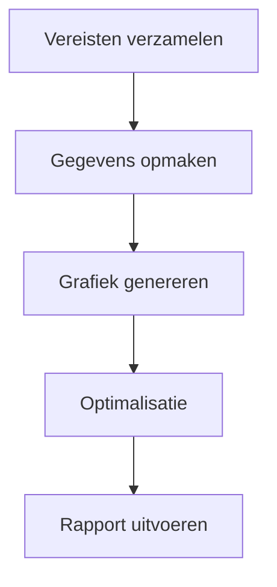
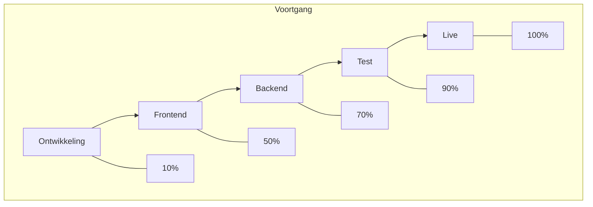

  

Bij het verwerken en visualiseren van gegevens is het omzetten van tabellen naar duidelijke grafieken een cruciale stap om informatie effectiever te communiceren. Of het nu gaat om takenplannen in projectbeheer, statistische resultaten in data-analyse of stroomdiagrammen in technische documentatie: wanneer "tabelgegevens" duidelijker en toonbaarder moeten worden, is een tool die direct tabellen (met name ondersteuning voor `graph td`-formaten) omzet naar grafieken onmisbaar. Dergelijke tools besparen handmatig opmaken en formaten converteren, waardoor gegevens van "statische tabellen" overgaan naar "dynamische grafieken" en complexe informatie helder overbrengen.  

### Waarom is een speciale tool voor het genereren van grafieken uit tabellen nodig?  

Bij traditionele methoden proberen gebruikers vaak Excel voor grafieken, PowerPoint voor afbeeldingen of online tools zoals Google Charts om gegevens handmatig om te zetten. Deze benaderingen hebben echter beperkingen:  

- **Handmatige bewerkingen zijn complex**: In Excel moet je herhaaldelijk het gegevensbereik instellen, het grafiektype kiezen en stijl aanpassen – tijdrovend en foutgevoelig;  
- **Lage compatibiliteit**: Bij tabellen met speciale structuren (zoals geneste tabellen of meerniveaus van `td`-definities) kunnen traditionele tools niet intelligent omzetten naar visualisaties;  
- **Geen realtime updates**: Geen mogelijkheid om de grafiek direct na het aanpassen van de tabel te bekijken, wat leidt tot afwijkingen tussen verwachting en resultaat.  

Een speciale tool voor het genereren van grafieken uit tabellen gebruikt vaak gestructureerde syntax (zoals de stroomdiagramsyntax van Mermaid), waardoor `graph td`-gegevens direct in grafieken worden omgezet. Dit realiseert een "syntax = grafiek"-benadering voor efficiënt omzetten.  

### Aanbevolen tool: Mermaid-live-editor – eenvoudig `graph td` omzetten naar grafieken  

Bij de vele tools die tabellen naar grafieken omzetten, is **Mermaid-live-editor** ([https://tools.cmdragon.cn/apps/mermaid-live-editor](https://tools.cmdragon.cn/apps/mermaid-live-editor)) een uitstekende keuze dankzij ondersteuning voor `graph td`, realtime preview en export naar meerdere formaten. Kernvoordelen:  

#### 1. Ondersteunt `graph td`-syntax voor nauwkeurige tabellenomzetting  

`graph td` is de kernsyntax in Mermaid voor het definiëren van **horizontale stroomtabellen**, vaak gebruikt voor processen met volgorde (zoals Gantt-diagrammen, taaktoewijzingen of stapsgewijze processen). Gebruikers typen gewoon `graph td`-gegevens in Mermaid-live-editor, en de tool genereert direct de visuele grafiek. Bijvoorbeeld, invoer van deze `graph td`-code:  

De tool renderd direct een horizontaal stroomdiagram. Elk knooppunt (zoals A, B, C) wordt automatisch een rechthoek in de grafiek, met pijlen die de stapvolgorde aangeven. Dit bespaart veel tijd vergeleken met handmatig tekenen, vooral geschikt voor technische documentatie en projectbeheer.  

#### 2. Realtime bewerken + export naar meerdere formaten voor veelzijdige gebruik  

Mermaid-live-editor is een **online tool zonder installatie**, direct gebruikbaar door de link te openen. Links schrijf je `graph td` of andere Mermaid-syntax (zoals `flowchart`, `gantt`, `pie`), rechts wordt de grafiek direct bijgewerkt. Ook ondersteunt het **sleepen om knooppunten te herschikken** en **stijl aanpassen** (kleur, lettertype, pijlen).  

Na genereren kan de grafiek eenvoudig worden geëxporteerd naar PNG of SVG, geschikt voor insluiten in Word, PowerPoint, Markdown of delen op platforms zoals GitHub. Dit lost het probleem op van "genereren → exporteren → aanpassen" in meerdere stappen.  

#### 3. Lichtgewicht syntax zonder leercurve, snel in gebruik  

De syntax van Mermaid-live-editor is eenvoudig en duidelijk. Zelfs beginners kunnen snel aan de slag door "knooppuntdefinitie (A[Inhoud]) + relatiebeschrijving (-->)" te begrijpen. Bijvoorbeeld, gebruik van `graph td` voor een tabel met "taaknaam", "verantwoordelijke" en "voortgang":  

  
Zo wordt zowel de stroom als de voortgang duidelijk weergegeven.  

### Conclusie  
Met Mermaid-live-editor wordt het visualiseren van tabellen naar grafieken een eenvoudige, efficiënte en professionele taak – perfect voor teams die duidelijke, data-gebaseerde communicatie nodig hebben. Probeer het uit voor je volgende project!