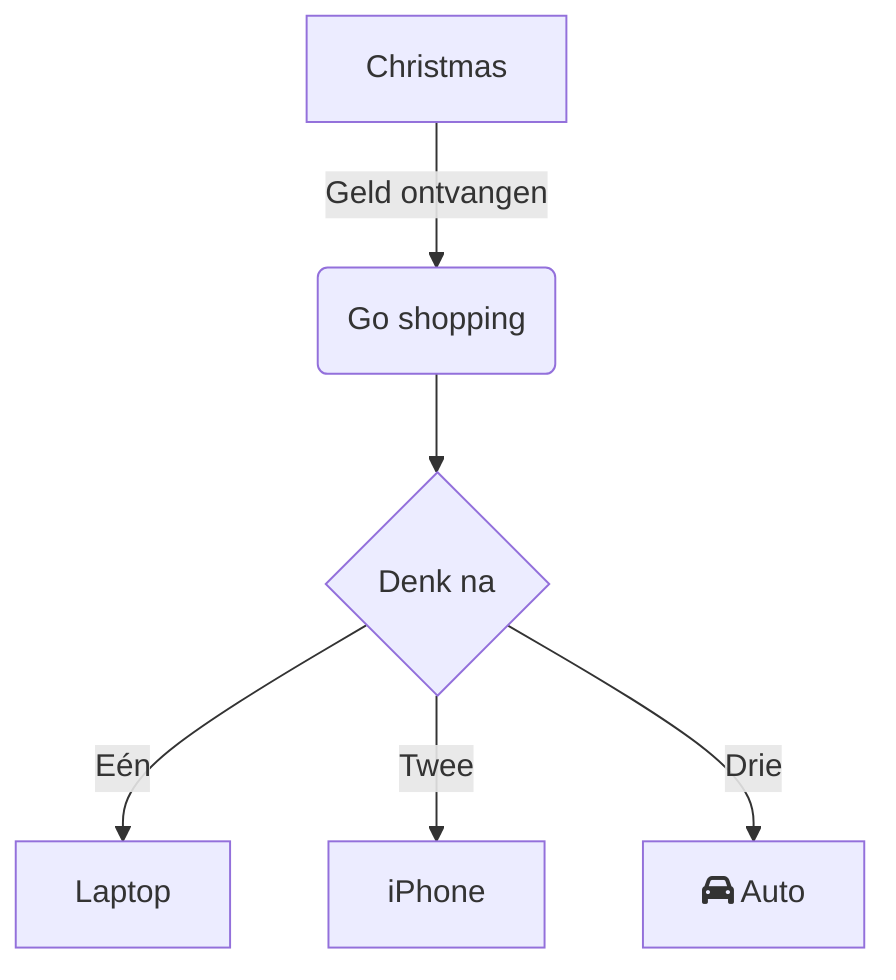

In de moderne werkomgeving en studie is een stroomdiagram een essentieel visueel communicatiehulpmiddel, vaak gebruikt voor het structureren van logica, het tonen van systeemarchitectuur of het plannen van takenstappen. Of het nu gaat om projectverdeling op het werk of kennisstructurering tijdens het studeren: een eenvoudige, gebruiksvriendelijke tool voor stroomdiagrammen zonder complexe configuratie verhoogt de efficiëntie aanzienlijk.

**Mermaid Live Editor**
([Klik hier om te openen](https://tools.cmdragon.cn/apps/mermaid-live-editor): https://tools.cmdragon.cn/apps/mermaid-live-editor) is precies zo'n online stroomdiagramtool. Met zijn lichte, realtime en syntaxisgebaseerde eigenschappen kan zelfs een beginnende gebruiker snel professionele diagrammen tekenen.

### 1. Waarom kiest u **Mermaid Live Editor**?

In vergelijking met traditionele stroomdiagramsoftware (zoals Visio of Draw.io) heeft **Mermaid Live Editor** duidelijke voordelen:

- **Geen installatie nodig**: Direct gebruiken via browser, compatibel met Windows, Mac, Linux en andere systemen.
- **Syntaxisgebaseerd, logisch**: Beschrijf het diagram met tekstvergelijkbaar met code, met directe voorbeeldweergave. Wijzigingen in de syntaxis worden direct weergegeven.
- **Lichtgewicht samenwerken**: De gegenereerde diagramcode kan direct worden gedeeld of geëxporteerd als afbeelding/Markdown, ideaal voor documenten en vergaderingen.
- **Volledige scenario-ondersteuning**: Ondersteunt niet alleen stroomdiagrammen, maar ook sequentiediagrammen, Gantt-diagrammen, statusdiagrammen en mindmap, voldoende aan verschillende behoeften.

Als u op zoek bent naar een "online, eenvoudige syntaxis, volledige functionaliteit" stroomdiagramtool, open dan direct **Mermaid Live Editor** ([https://tools.cmdragon.cn/apps/mermaid-live-editor](https://tools.cmdragon.cn/apps/mermaid-live-editor]) om het uit te proberen.

### 2. Volledige gebruiksgids voor Mermaid Live Editor

#### 1. Snel beginnen: Tool openen en interface begrijpen

**Stap 1**: Klik op **Mermaid Live Editor**-link ([https://tools.cmdragon.cn/apps/mermaid-live-editor](https://tools.cmdragon.cn/apps/mermaid-live-editor)), ga naar de online bewerkingsinterface. Links staat de "codebewerkingsruimte", rechts de "directe voorbeeldweergave". Bovenin midden vindt u knoppen voor "syntaxis sjablonen", "exportformaat" en "themawisseling", onderaan staat "foutmeldingen" en "sneltoetsenbalk".

#### 2. Stroomdiagram tekenen: Van basis syntaxis tot creatieve implementatie

**Stap 1: Basis stroomdiagram code invoeren**  
Mermaid gebruikt specifieke syntaxis om diagramstructuren te definiëren. Als voorbeeld voor de eenvoudigste "richting + knooppunt + verbinding":

Plak deze code in de **links bewerkingsruimte**, de rechts weergave genereert direct het diagram. Pas `TD` (richting), `graph` (type), `-->|label|` (verbinding met tekst) aan om de logica flexibel te wijzigen.

**Stap 2: Gebruik syntaxis sjablonen om gebruiksgemak te vergroten**  
Bij onbekendheid met syntaxis, klik op **bovenste syntaxis sjablonenbibliotheek** (bijv. "Stroomdiagram sjabloon", "Gantt-diagram sjabloon"), kies een vooraf gedefinieerd sjabloon en pas parameters aan (zoals knooppuntnaam, taakduur). Dit vermindert de creatie kosten vanaf nul. De tool ondersteunt ook **automatische syntaxisaanvulling**: na `graph` verschijnt een lijst met mogelijke lay-outs (TD, LR etc.), na `[ ]` wordt de standaard knooppuntstijl automatisch gegenereerd. Beginnende gebruikers kunnen snel aan de slag.

**Stap 3: Exporteren en delen**  
Na voltooiing klik op **rechtsboven "exporteren"**-knop, kies voor PNG (hoge resolutie), SVG (vectorformaat) of kopieer Markdown-code rechtstreeks in documenten. Voor teamwerking kan de bewerkingspagina direct worden gedeeld met collega's; deze kunnen de link openen en bewerken.

### 3. Waarom Mermaid Live Editor?

- **Geen installatie**: Direct starten zonder software.
- **Syntaxisgebaseerd**: Geen afbeeldingen, alleen code.
- **Directe voorbeeldweergave**: Wijzigingen in code worden direct weergegeven.
- **Volledig compatibel**: Werkt in alle browsers en besturingssystemen.
- **Exporteerbaar**: Gebruik in documenten, presentaties of code.

Voor professionals en studenten is Mermaid Live Editor de ideale tool om complexe processen visueel te structureren. Probeer het vandaag nog!  
([https://tools.cmdragon.cn/apps/mermaid-live-editor](https://tools.cmdragon.cn/apps/mermaid-live-editor))