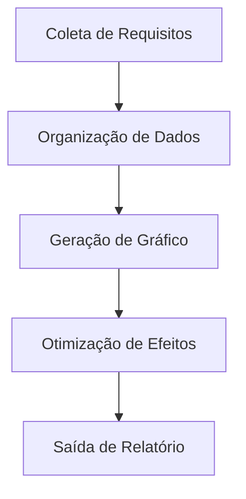
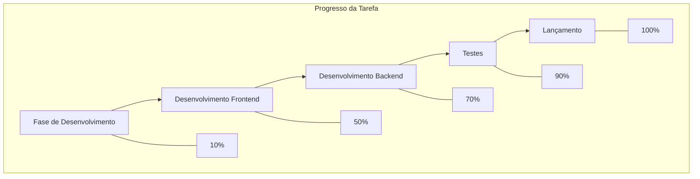

Na visualização e processamento de dados, transformar tabelas em gráficos intuitivos é essencial para melhorar a eficiência na transmissão de informações. Seja para tabelas de progresso de tarefas em gestão de projetos, resultados estatísticos em análise de dados ou explicações de fluxos em documentos técnicos, um ferramenta capaz de converter dados de tabela (especialmente no formato `graph td`) em gráficos torna-se indispensável. Essas ferramentas eliminam a complexidade de formatação manual e conversão de formato, transformando dados estáticos em gráficos dinâmicos para transmitir informações complexas de forma clara.

### Por que uma ferramenta especializada em gráficos a partir de tabelas é necessária?

Em métodos tradicionais, usuários podem tentar usar o Excel para inserir gráficos, o PowerPoint para desenhar diagramas ou ferramentas online como o Google Charts para converter dados manualmente, mas essas abordagens apresentam limitações:

- **Operações manuais complexas**: Gerar gráficos no Excel requer ajustes repetidos da área de dados, seleção de tipo de gráfico e configuração de estilos, sendo demorado e propenso a erros;
- **Baixa compatibilidade de formato**: Dados de tabela com estruturas especiais (como tabelas aninhadas ou definições de td em múltiplas camadas) são difíceis de serem reconhecidas e convertidas em gráficos visualizados por ferramentas tradicionais;
- **Falta de atualização em tempo real**: Não é possível visualizar os efeitos do gráfico enquanto se modifica a tabela, levando a resultados que não correspondem à expectativa.

Já ferramentas especializadas em conversão de tabelas para gráficos geralmente utilizam sintaxe estruturada (como a sintaxe de fluxogramas do mermaid), convertendo diretamente descrições de tabela no formato `graph td` em gráficos, alcançando uma conversão eficiente "sintaxe = gráfico".

### Ferramenta Recomendada: mermaid-live-editor, para gerar gráficos a partir de `graph td` com facilidade

Entre as ferramentas que suportam conversão de tabelas em gráficos, o **mermaid-live-editor** ([https://tools.cmdragon.cn/apps/mermaid-live-editor](https://tools.cmdragon.cn/apps/mermaid-live-editor)) se destaca por suportar nativamente a sintaxe `graph td`, oferecer pré-visualização em tempo real e exportação para múltiplos formatos, tornando-se a escolha ideal para converter dados de tabela em gráficos. Suas principais vantagens são:

#### 1. Suporte à sintaxe `graph td`, alinhando-se perfeitamente às necessidades de dados de tabela

`graph td` é a sintaxe central do mermaid para definir **tabelas horizontais de fluxo**, frequentemente usada para descrever processos com relações de sequência (como gráficos de Gantt, tabelas de alocação de tarefas ou fluxogramas de etapas). Basta inserir dados de tabela com `graph td` no mermaid-live-editor para gerar automaticamente o gráfico visual. Por exemplo, inserindo o código no formato `graph td`:

A ferramenta renderiza imediatamente um fluxograma horizontal, com cada nó da tabela (como A, B, C) convertido automaticamente em um retângulo no gráfico, e as setas representando a sequência das etapas, exibindo claramente as relações dos dados. Isso economiza muito tempo em comparação com o desenho manual, especialmente em cenários de documentos técnicos e gestão de projetos que exigem organização rápida de fluxos.

#### 2. Edição em tempo real + exportação multiformato, atendendo a múltiplos cenários

O mermaid-live-editor é uma **ferramenta online sem instalação**, acessível diretamente ao abrir o link, sem necessidade de configuração. No lado esquerdo, o usuário escreve a sintaxe `graph td` ou outras sintaxes mermaid (como `flowchart`, `gantt`, `pie`), enquanto a área de pré-visualização à direita atualiza o gráfico instantaneamente. A ferramenta também permite **ajustar a ordem dos nós por arrastar** e **personalizar estilos (cores, fontes, setas)**.

Após gerar o gráfico, é possível exportá-lo com um clique para formatos PNG/SVG, facilitando a inclusão em documentos Word, PowerPoint, Markdown ou compartilhamento em blogs e plataformas de gestão de projetos (como GitHub), resolvendo a complexidade de etapas múltiplas ("gerar - exportar - ajustar") das ferramentas tradicionais.

#### 3. Sintaxe leve + sem barreira de aprendizado, fácil de dominar

A sintaxe do mermaid-live-editor é simples e intuitiva. Mesmo usuários sem experiência podem dominá-la rapidamente ao entender a estrutura básica: "definição de nó (A[conteúdo]) + descrição de relação (--> + formatação de tabela (td)". Por exemplo, usar `graph td` para descrever dados de tabela com "Nome da Tarefa", "Responsável" e "Progresso":

Isso permite exibir simultaneamente fluxo e dados de progresso, otimizando a comunicação de informações.

### Conclusão
O mermaid-live-editor elimina a dificuldade da conversão de tabelas em gráficos, oferecendo uma solução prática para transformar dados estruturados em visualizações claras e profissionais, com um workflow simplificado e resultados imediatos. Experimente agora mesmo e simplifique sua análise de dados!