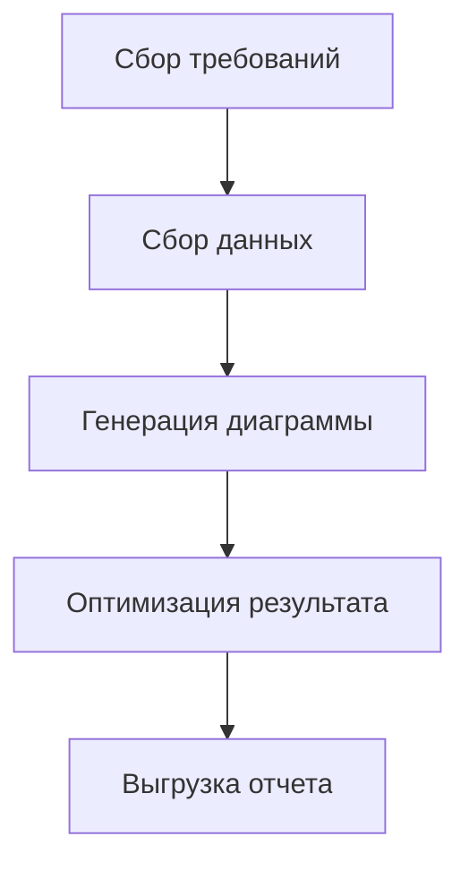

В сценариях обработки данных и визуализации преобразование таблиц в наглядные диаграммы является ключевым шагом для повышения эффективности передачи информации. Будь то таблицы прогресса задач в управлении проектами, статистические результаты в анализе данных или описания процессов в технической документации, когда необходимо сделать «таблицы данных» более читабельными и презентабельными, инструмент, способный напрямую преобразовывать таблицы (особенно в формате `graph TD`) в диаграммы, становится незаменимым. Такие инструменты избавляют от рутинных операций по ручной верстке и преобразованию форматов, превращая данные из «статических таблиц» в «динамические диаграммы» и тем самым четче передавая сложную информацию.

### Почему необходим специализированный инструмент для преобразования таблиц в диаграммы?

В традиционных подходах пользователи могут пытаться использовать Excel для построения диаграмм, PowerPoint для рисования графики или онлайн-инструменты вроде Google Charts для ручного преобразования данных, но эти методы часто имеют ограничения:

- **Сложность ручных операций**: Создание диаграмм в Excel требует повторной настройки диапазона данных, выбора типа диаграммы и стиля, что занимает много времени и часто приводит к ошибкам;
- **Низкая совместимость форматов**: Если таблица содержит сложные структуры (вложенные таблицы, многоуровневые определения td), традиционные инструменты не могут интеллектуально распознать их и преобразовать в визуализацию;
- **Недостаточная оперативность**: Невозможно видеть эффект диаграммы в реальном времени при редактировании данных, что приводит к несоответствию финального результата ожиданиям.

Специализированные инструменты для преобразования таблиц в диаграммы обычно основаны на структурированном синтаксисе (например, синтаксисе диаграмм Mermaid), что позволяет напрямую преобразовывать описания таблиц в формате `graph TD` в диаграммы, обеспечивая эффективное преобразование «синтаксис = диаграмма».

### Рекомендуемый инструмент: Mermaid Live Editor — простое преобразование данных `graph TD` в диаграммы

Среди инструментов, поддерживающих преобразование таблиц в диаграммы, **Mermaid Live Editor** ([https://tools.cmdragon.cn/apps/mermaid-live-editor](https://tools.cmdragon.cn/apps/mermaid-live-editor)) благодаря нативной поддержке синтаксиса `graph TD`, возможности реального предварительного просмотра и экспорт в несколько форматов стал оптимальным выбором для преобразования таблиц в диаграммы. Его ключевые преимущества:

#### 1. Поддержка синтаксиса `graph TD` для точного соответствия потребностям преобразования таблиц

`graph TD` — это ключевая структура в синтаксисе Mermaid, используемая для определения **горизонтальных таблиц процессов**, часто применяющаяся для описания процессов с последовательностью (например, диаграммы Ганта, таблицы распределения задач, диаграммы шагов). Пользователь просто вводит данные таблицы в формате `graph TD` в Mermaid Live Editor, и инструмент немедленно генерирует соответствующую визуализацию. Например, ввод следующего кода в формате `graph TD`:

Инструмент мгновенно отобразит горизонтальную диаграмму процессов. Каждый узел таблицы (например, A, B, C) автоматически соответствует прямоугольнику на диаграмме, стрелки обозначают последовательность шагов, наглядно отображая отношения данных. Это экономит массу времени по сравнению с ручным построением диаграмм, особенно в сценариях технической документации и управления проектами, где требуется быстро структурировать процессы.

#### 2. Редактирование в реальном времени + экспорт в несколько форматов для разных сценариев

Mermaid Live Editor — это **онлайн-инструмент без установки**, который можно использовать сразу после открытия ссылки, без настройки окружения. Пользователь вводит синтаксис `graph TD` или другой синтаксис Mermaid (например, `flowchart`, `gantt`, `pie`) в левом поле, а правая область предварительного просмотра мгновенно обновляет изображение диаграммы. Также поддерживается **перетаскивание для изменения порядка узлов** и **настройка стиля (цвет, шрифт, стрелки)**.

После генерации диаграммы можно экспортировать её в форматы PNG/SVG. Это делает инструмент удобным для управления проектами и технической документации.

#### 3. Дружественный синтаксис для быстрого освоения

Инструмент предоставляет простой и интуитивно понятный синтаксис, позволяющий новичкам быстро создавать профессиональные диаграммы без углубленного изучения сложных спецификаций.

---

  
*Пример диаграммы, созданной с помощью Mermaid Live Editor*  

Используя Mermaid Live Editor, вы можете легко преобразовывать данные из таблиц в наглядные диаграммы, экономя время на ручной верстке и обеспечивая высокую точность визуализации. Это идеальный выбор для команд, работающих с технической документацией, управлением проектами и анализом данных. Начните использовать его уже сегодня — один клик для профессиональной диаграммы.