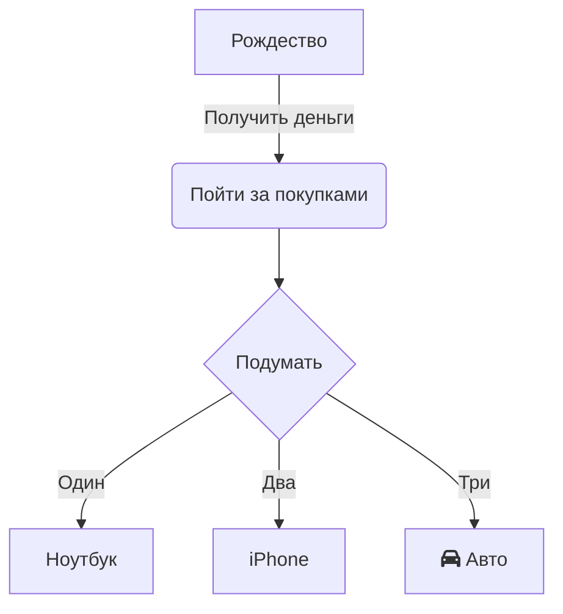

В современной работе и обучении диаграммы потока играют ключевую роль в визуализации логики процессов, представлении архитектуры систем и планировании задач. Будь то разбор проекта в корпоративной среде или структурирование знаний в учебе, простой и удобный инструмент для создания диаграмм значительно повышает продуктивность.
**Mermaid Live Editor** (ссылка: [https://tools.cmdragon.cn/apps/mermaid-live-editor](https://tools.cmdragon.cn/apps/mermaid-live-editor)) — это онлайн-редактор диаграмм, который благодаря лёгкости, реальному времени и синтаксис-ориентированному подходу позволяет даже новичкам быстро создавать профессиональные диаграммы.

### 1. Почему стоит выбрать **Mermaid Live Editor**?

В сравнении с традиционными инструментами (Visio, Draw.io и др.) **Mermaid Live Editor** предлагает существенные преимущества:

- **Без установки**: Используйте прямо в браузере, без ограничений по ОС (Windows, Mac, Linux).
- **Синтаксис-ориентированный, логичный**: Описывайте диаграммы текстом, похожим на код. Редактируйте синтаксис и сразу видите результат в режиме реального времени.
- **Лёгкая совместная работа**: Сгенерированный код диаграммы можно легко поделиться или экспортировать в изображение/Markdown, что удобно для документов и встреч.
- **Полный охват сценариев**: Создавайте не только диаграммы потока, но и последовательности, Ганта, состояний, схемы мышления — подходит для любых задач.

Если вам нужен онлайн-инструмент, который работает немедленно, имеет простой синтаксис и полный функционал, откройте **Mermaid Live Editor** ([https://tools.cmdragon.cn/apps/mermaid-live-editor](https://tools.cmdragon.cn/apps/mermaid-live-editor)) и попробуйте.

### 2. Пошаговое руководство по использованию Mermaid Live Editor

#### 1. Быстрый старт: Открытие и знакомство с интерфейсом

**Шаг 1**: Перейдите по ссылке **Mermaid Live Editor** ([https://tools.cmdragon.cn/apps/mermaid-live-editor](https://tools.cmdragon.cn/apps/mermaid-live-editor)), чтобы открыть онлайн-редактор. Слева расположена область для ввода кода, справа — предварительный просмотр. В верхней части есть кнопки для библиотеки шаблонов синтаксиса, форматов экспорта и смены темы. Внизу отображаются предупреждения об ошибках и панель быстрых действий.

#### 2. Создание диаграммы: От базового синтаксиса до креатива

**Шаг 1: Ввод базового кода диаграммы потока**  
Mermaid использует специальный синтаксис для определения структуры. Рассмотрим простой пример с направлением, узлами и связями:

Вставьте этот код в **область слева** — справа будет отображаться диаграмма в реальном времени. Вы можете настраивать детали: направление (`TD`), тип диаграммы (`graph`), текстовые подписи к связям (`-->|Подпись|`).

**Шаг 2: Использование шаблонов и подсказок для снижения порога входа**  
Если вы не знакомы со синтаксисом, нажмите на **библиотеку шаблонов синтаксиса** (например, «Шаблон диаграммы» или «Шаблон Ганта»), выберите готовый шаблон и измените параметры (названия узлов, продолжительность задач). Инструмент также поддерживает **автодополнение синтаксиса** — это ускорит освоение.

**Шаг 3: Экспорт и использование**  
После создания диаграммы экспортируйте её в PNG, SVG или Markdown через кнопку **Экспорт**. Такие диаграммы легко встраивать в отчёты, документацию или презентации.

### 3. Ключевые преимущества для профессионалов и студентов

- **Для команд**: Совместная работа без сложных инсталляций — все участники видят изменения в реальном времени.
- **Для студентов**: Быстрое создание диаграмм для учебных проектов и презентаций без обучения специализированному ПО.
- **Для разработчиков**: Интеграция с Markdown-документацией кода через простой синтаксис.

Mermaid Live Editor — это не просто инструмент, а способ упростить коммуникацию через визуализацию. Начните использовать его сегодня, чтобы сэкономить время и сделать работу более наглядной.  
**Попробуйте прямо сейчас: [https://tools.cmdragon.cn/apps/mermaid-live-editor](https://tools.cmdragon.cn/apps/mermaid-live-editor)**.