Veri işleme ve görselleştirme alanlarında, tablo verilerini somut grafiklere dönüştürmek bilgi aktarımını hızlandırmak için kritik bir adımdır. Proje yönetimi için görev ilerleme tabloları, veri analizi sonuçları veya teknik belgelerdeki akış açıklamaları gibi senaryolarda, "tablo verilerini" daha okunabilir ve sunum açısından etkili hale getirmek için, özellikle `graph td` formatını destekleyen tablo verilerini grafiklere dönüştüren bir araç gereklidir. Bu tür araçlar, el ile düzenlemeyi ve format dönüşümünü atlayarak veriyi "statik tablodan" "dinamik grafiklere" dönüştürür ve karmaşık bilgileri daha net iletmeyi sağlar.

### Neden özel "tablo verisi grafik üretimi" araçları gereklidir?

Geleneksel yöntemlerde, kullanıcılar Excel ile grafik eklemek, PowerPoint ile grafik çizmek veya Google Charts gibi çevrimiçi araçlarla veriyi manuel olarak dönüştürmeye çalışabilir. Ancak bu yöntemler genellikle aşağıdaki sınırlamaları taşır:

- **El ile işlemler karmaşık**: Excel ile grafik oluşturmak, veri alanını tekrar ayarlamak, grafik türünü seçmek ve stilleri ayarlamak gibi zaman alıcı ve hata yapmaya açık adımları gerektirir;
- **Format uyumluluğu düşük**: Tablo verisi iç içe tablolar veya çok katmanlı td tanımları gibi özel yapılar içerdiğinde, geleneksel araçlar bu verileri akıllıca algılayıp görselleştirme grafiklerine dönüştüremez;
- **Gerçek zamanlılık eksikliği**: Tablo verilerini düzenlerken grafik etkisini anında önizleyememe, nihai sunumun beklentilerle uyuşmamasına neden olur.

Özel olarak "tablo verisi grafik üretimi" için tasarlanmış araçlar, genellikle yapılandırılmış sentaks (örneğin mermaid'in akış şeması sentaksı) temelli olup, `graph td` gibi tablo tanımlarını doğrudan grafiklere dönüştürür ve "sentaks = grafik" şeklinde verimli bir dönüşüm sağlar.

### Önerilen Araç: mermaid-live-editor, `graph td` verisini kolayca grafik üretir

Tablo verisi grafiklere dönüştüren araçlar arasında, **mermaid-live-editor** ([https://tools.cmdragon.cn/apps/mermaid-live-editor](https://tools.cmdragon.cn/apps/mermaid-live-editor)), `graph td` sentaksını orijinal olarak desteklemesi, gerçek zamanlı düzenlemeyi ve önizlemeyi ve çoklu format dışa aktarım özelliklerini sunmasıyla tercih edilen araçtır. Temel avantajları şunlardır:

#### 1. `graph td` sentaksını destekler, tablo verisi ihtiyaçlarını tam olarak karşılar

`graph td`, mermaid sentaksında **yatay akış tablosu** tanımlamak için kullanılan temel yapıdır ve genellikle sıralı ilişki içeren akışları (Gantt diyagramı, görev atama tablosu, adım akış şemaları) açıklamak için kullanılır. Kullanıcı, mermaid-live-editor'da `graph td` içeren tablo verisini girdiğinde, otomatik olarak ilgili görsel grafik oluşturulur. Örneğin, aşağıdaki `graph td` formatındaki kodu girdiğinizde:

```mermaid
graph TD
    A["Gereksinim Toplama"] --> B["Veri Düzenleme"]
    B --> C["Grafik Üretimi"]
    C --> D["Etki İyileştirme"]
    D --> E["Rapor Çıktısı"]
```

Araç hemen yatay akış şemasını render eder; tablodaki her düğüm (A, B, C vb.) grafikte dikdörtgen kutular olarak otomatik olarak gösterilir, oklar adım sırasını gösterir ve veri ilişkileri net bir şekilde ortaya çıkar. Bu, akış şeması manuel çiziminden çok daha fazla zaman kazandırır, özellikle teknik belgeler ve proje yönetimi gibi akışı hızlı bir şekilde temsil etmeniz gereken senaryolarda faydalıdır.

#### 2. Gerçek zamanlı düzenleme + çoklu format dışa aktarımı, farklı senaryoları karşılar

mermaid-live-editor, **çevrimiçi, kurulum gerektirmeyen bir araçtır**; bağlantıyı açıp hemen kullanabilirsiniz. Sol taraftaki giriş alanına `graph td` veya diğer mermaid sentaksını (örneğin `flowchart`, `gantt`, `pie` grafikleri) yazdığınızda, sağ taraftaki gerçek zamanlı önizleme alanı grafik etkisini anında günceller. Ayrıca **düğüm sırasını sürükleyip bırakarak** ayarlamayı, **stilleri (renk, yazı tipi, oklar)** değiştirmeyi gibi özelleştirme özelliklerini destekler.

#### 3. Sentaks dostu ve öğrenme engeli yok

`graph td` sentaksı basit ve anlaşılır olduğu için, kullanıcılar hiç bir önceden bilgi olmadan hemen kullanmaya başlayabilir. Bu, yeni başlayanlar ve deneyimli kullanıcılar için ideal bir çözümdür.

---

**Profesyonel akış şeması ve ilerleme tablolarını tek tıkla oluşturun.** mermaid-live-editor ile tablo verilerinizi görselleştirme sürecini hızlandırın, görsel sunumları kolayca paylaşın ve veri analizlerinizi daha etkili bir şekilde iletmeyi başarmak için hemen başlayın. 🚀