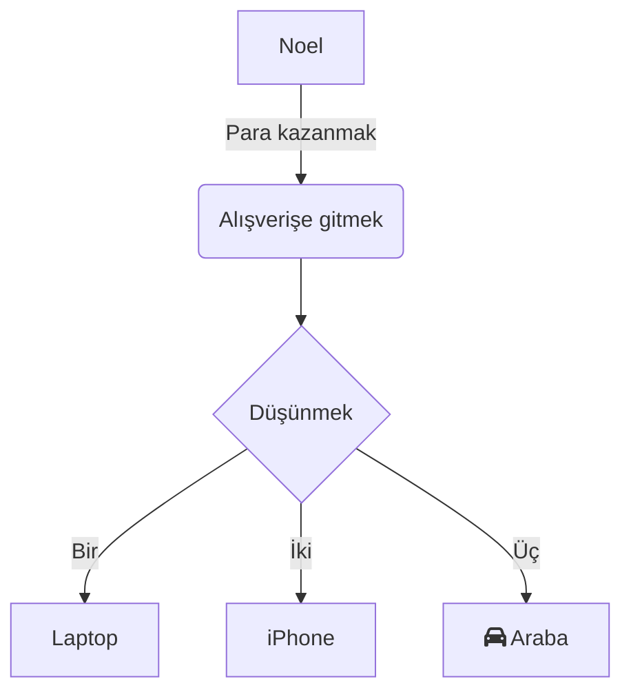

Modern iş ve öğrenme süreçlerinde akış şemaları, akış mantığını düzenlemek, sistem mimarisini göstermek veya görev adımlarını planlamak için görsel iletişim aracı olarak sıkça kullanılır. İş dünyasında proje parçalanması veya öğrenme sürecinde bilgi düzenlemesi gibi durumlarda, karmaşık ayarlara gerek olmayan, kolay kullanımlı bir akış şeması aracı verimliliği büyük ölçüde artırır.

**mermaid live editor**  
([Tıklayarak açın](https://tools.cmdragon.cn/apps/mermaid-live-editor): https://tools.cmdragon.cn/apps/mermaid-live-editor) tam olarak böyle bir çevrimiçi akış şeması aracıdır. Hafif, gerçek zamanlı ve sentaks odaklı özelliklerle, sıfır deneyimli kullanıcılar bile profesyonel akış şemaları çizmeyi kolayca öğrenebilir.

### Bir: **mermaid live editor**'ı Neden Seçmeli?

Geleneksel akış şeması yazılımları (Visio, Draw.io gibi) ile karşılaştırıldığında, **mermaid live editor** önemli avantajlara sahiptir:

- **Yüklemeye gerek yok**: Tarayıcı üzerinden doğrudan erişilebilir, Windows, Mac, Linux gibi tüm işletim sistemleri ve cihazlarla uyumludur.
- **Sentaks odaklı, mantık net**: Akış şemasını kod gibi metin diliyle tanımlar, gördükleriniz gibi (WYSIWYG) gerçek zamanlı öngörü sağlar. Sentaksı değiştirirken öngörü otomatik güncellenir.
- **Hafif işbirliği**: Oluşturulan grafik kodu doğrudan paylaşılabilir veya resim/Markdown formatında dışa aktarılabilir, belgelerde ve toplantıda kolayca kullanılabilir.
- **Tüm senaryoları destekler**: Akış şeması yanı sıra zaman çizelgesi, Gantt şeması, durum şeması, zihin haritası gibi çeşitli türleri destekler, farklı kullanım alanlarını karşılama imkânı sunar.

Eğer "çevrimiçi, basit sentaks ve kapsamlı özelliklere" sahip bir akış şeması aracı arıyorsanız, hemen **mermaid live editor**'ı deneyin  
([https://tools.cmdragon.cn/apps/mermaid-live-editor](https://tools.cmdragon.cn/apps/mermaid-live-editor)).

### İki: mermaid live editor Kullanım Süreci Kılavuzu

#### 1. Hızlı Başlangıç: Araç Açılışı ve Arayüz Tanıtımı

**Adım 1:** **mermaid live editor** bağlantısına tıklayarak ([https://tools.cmdragon.cn/apps/mermaid-live-editor](https://tools.cmdragon.cn/apps/mermaid-live-editor)), çevrimiçi düzenleyici arayüzüne girin. Araç sol tarafta "kod düzenleyici alanı", sağ tarafta "gerçek zamanlı öngörü alanı" olarak görünür. Ortada üst kısmında "sentaks şablonu", "dışa aktarma formatı", "tema değiştirme" gibi özellik düğmeleri bulunur. Alt kısımda ise "hata uyarıları" ve "kısayol çubuğu" yer alır.

#### 2. Akış Şeması Çizimi: Temel Sentakstan Yaratıcılığa

**Adım 1: Temel Akış Şeması Kodu Girme**  
mermaid, grafik yapılarını özel bir sentaksla tanımlar. En basit "yön + düğüm + bağlantı" örneğiyle başlayalım:

Yukarıdaki kodu **sol düzenleyici alana** yapıştırın, sağ öngörü alanı otomatik olarak akış şemasını oluşturacaktır. `TD` (yön), `graph` (tür), `-->|etiket|` (metinli bağlantı) gibi sentaks ayrıntılarını düzenleyerek grafik mantığını esnek bir şekilde değiştirebilirsiniz.

**Adım 2: Sentaks Şablonları ve İpuçları ile Kullanım Kolaylığı**  
Sentaksı bilmiyorsanız, üst kısımdaki **"sentaks şablonu kütüphanesi"** (örn. "akış şablonu", "Gantt şablonu")'na tıklayarak önceden tanımlanmış şablonları seçebilir, parametreleri (düğüm isimleri, görev süreleri vb.) değiştirerek sıfırdan创作 maliyetini azaltabilirsiniz.

**Adım 3: Dışa Aktarma**  
İhtiyacınıza göre şemayı **"Dışa Aktar"** butonuna tıklayarak resim veya Markdown formatında dışa aktarın.

### Üç: Örnek Senaryo

*Öğrenci:* "Bilgi düzenlemesi için akış şeması oluşturmak istiyorum, basit ve hızlı olmalı."  
→ mermaid live editor'da "akış şablonu" seçip, temel sentaksı kullanarak 5 dakikada şemayı oluşturabilir.

*İş Dünyası:* "Proje akışını görsel olarak göstermek için zaman çizelgesi gerekli."  
→ mermaid live editor'da "zaman çizelgesi" şablonuyla, görev adımlarını ve sürelerini kolayca ekleyebilirsiniz.

**mermaid live editor** ile akış şemaları çizmek artık çok daha kolay! Hemen deneyin. 🚀