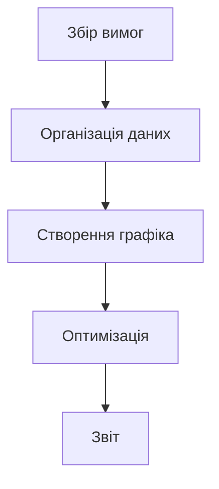

У сфері обробки даних та їх візуалізації перетворення таблиць у зрозумілі графіки є ключовим кроком для підвищення ефективності передачі інформації. Чи це таблиця стану завдань у проектному менеджменті, статистичні результати аналізу або опис процесів у технічній документації — коли потрібно зробити «дані таблиць» більш читабельними та презентабельними, інструмент, що безпосередньо перетворює дані таблиць (зокрема, формат `graph td`) у графіки, стає незамінним. Такі інструменти виключають складні ручні операції з форматування та перетворення даних, перетворюючи статичні таблиці на динамічні графіки для чіткішого відображення складної інформації.

### Чому потрібен спеціальний інструмент для створення графіків з таблиць?

У традиційному підході користувачі можуть спробувати створювати графіки у Excel, малювати діаграми у PowerPoint або використовувати онлайн-інструменти, як Google Charts, але ці методи мають обмеження:

- **Складність ручного керування**: У Excel для створення графіка потрібно постійно налаштовувати діапазон даних, вибирати тип діаграми, налаштовувати стиль — це займає багато часу та призводить до помилок;
- **Низька сумісність форматів**: Якщо таблиця містить спеціальні структури (наприклад, вкладені таблиці або багаторівневі td), традиційні інструменти важко інтелектуально розпізнати їх і перетворити на візуалізацію;
- **Недостатня реальність**: Неможливо одночасно редагувати дані таблиці та переглядати результат, що призводить до розбіжностей між кінцевим відображенням і очікуваним результатом.

Специфічні інструменти для створення графіків з таблиць зазвичай базуються на структурованому синтаксисі (наприклад, синтаксису діаграм Mermaid), що безпосередньо перетворює опис таблиць у форматі `graph td` на графіки, реалізуючи «синтаксис = графік» для ефективного перетворення.

### Рекомендований інструмент: Mermaid Live Editor — просте створення графіків з `graph td`

Серед інструментів, що підтримують перетворення даних таблиць у графіки, **Mermaid Live Editor** ([https://tools.cmdragon.cn/apps/mermaid-live-editor](https://tools.cmdragon.cn/apps/mermaid-live-editor)) відзначається нативною підтримкою синтаксису `graph td`, реальним редагуванням з переглядом та можливістю експорту в кілька форматів. Його основні переваги:

#### 1. Підтримка синтаксису `graph td`, точно відповідає потребам таблиць

`graph td` — це ключовий синтаксис Mermaid для визначення **горизонтальних таблиць процесів**, що часто використовується для опису послідовних процесів (наприклад, діаграми Ганта, таблиці розподілу завдань, схеми кроків). Користувач просто вводить дані таблиці у форматі `graph td` у Mermaid Live Editor, і інструмент автоматично генерує відповідну візуалізацію. Наприклад, введення такого коду:

Інструмент негайно візуалізує горизонтальну діаграму. Кожен вузол таблиці (A, B, C тощо) автоматично перетворюється на елемент діаграми. 

#### 2. Реальний перегляд із зручним налаштуванням

Можна перетягувати елементи для швидкого налаштування макету, додаючи інтерактивність без складного коду.

#### 3. Експорт у різні формати

Готові діаграми легко експортувати у PNG, SVG або інші формати для використання у документах, презентаціях чи веб-сторінках.

### Де застосовується Mermaid Live Editor?

- **Проектний менеджмент**: Створення діаграм Ганта та відстеження стану завдань.
- **Технічна документація**: Чітке відображення процесів та алгоритмів.
- **Аналіз даних**: Візуалізація структурованих даних таблиць для швидкого розуміння.

З Mermaid Live Editor створення професійних графіків з даних таблиць стає простим і швидким процесом — без складного навчання, лише один клік для перетворення даних у візуалізацію. Це інструмент, який робить складну роботу з даними настільки ж легкою, як звичайний текст. 🚀