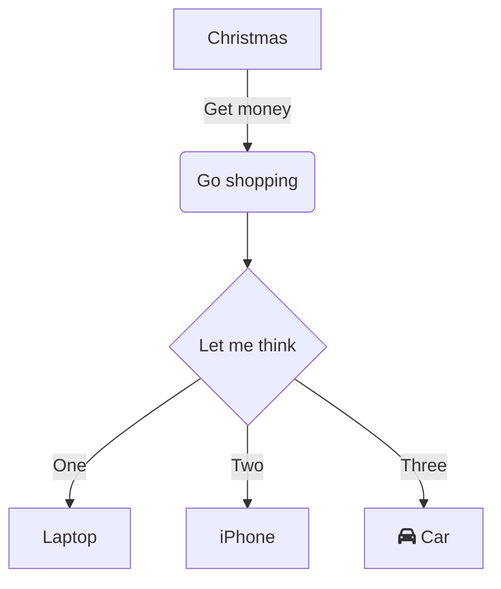

在现代工作与学习中，流程图作为可视化沟通的重要工具，常被用于梳理流程逻辑、展示系统架构或规划任务步骤。无论是职场中的项目拆解，还是学习中的知识梳理，一款简单易用、无需复杂配置的流程图工具都能大幅提升效率。
**mermaid live editor**
（[点击进入](https://tools.cmdragon.cn/apps/mermaid-live-editor)：https://tools.cmdragon.cn/apps/mermaid-live-editor ）正是这样一款在线流程图绘制工具，它以轻量、实时、语法化的特点，让零基础用户也能快速上手绘制专业流程图。

### 一、为什么选择**mermaid live editor**？

相比传统流程图软件（如Visio、Draw.io等），**mermaid live editor** 具有显著优势：

- **无需安装**：直接通过浏览器访问即可使用，兼容Windows、Mac、Linux等各类系统和设备。
- **语法驱动，逻辑清晰**：用类似代码的文本语法描述流程图，所见即所得，修改语法的同时实时预览效果。
- **轻量化协作**：生成的图形代码可直接分享或导出为图片/Markdown格式，方便在文档、会议中复用。
- **全场景支持**：不仅能绘制流程图，还支持时序图、甘特图、状态图、思维导图等多种类型，满足不同场景需求。

如果你正需要一款「在线即用、语法简洁、功能全面」的流程图工具，不妨直接打开 **mermaid live editor
**（[https://tools.cmdragon.cn/apps/mermaid-live-editor](https://tools.cmdragon.cn/apps/mermaid-live-editor)） 体验。

### 二、mermaid live editor 使用全流程指南

#### 1. 快速上手：打开工具与界面认知

**第一步**：点击 **mermaid live editor**
链接（[https://tools.cmdragon.cn/apps/mermaid-live-editor](https://tools.cmdragon.cn/apps/mermaid-live-editor)） ，进入在线编辑界面。工具左侧为「代码编辑区」，右侧为「实时预览区」，中间顶部有「语法模板库」「导出格式」「主题切换」等功能按钮，底部则是「错误提示」和「快捷操作栏」。

#### 2. 绘制流程图：从基础语法到创意实现

**Step 1：输入基础流程图代码**  
mermaid 通过特定语法定义图形结构，以最简单的「方向+节点+连线」为例：

将上述代码粘贴到 **左侧编辑区**，右侧预览区会实时生成流程图，你可通过调整 `TD`（方向）、`graph`（类型）、`-->|标签|`
（带文字的连线）等语法细节，灵活修改图形逻辑。

**Step 2：利用语法模板与提示降低使用门槛**  
若对语法不熟悉，可点击 **顶部语法模板库**（如“流程模板”“甘特图模板”），选择预设模板后修改参数（如节点名称、任务时长等），大幅减少从零开始的创作成本。工具还支持
**自动补全语法**，输入 `graph` 后会提示可选布局（TD、LR等），输入`[ ]` 会自动生成标准节点样式，新手也能快速上手。

**Step 3：导出与分享**  
流程图完成后，点击 **右上角「导出」按钮**
，可选择导出为PNG图片（高清）、SVG（矢量格式）或直接复制Markdown代码嵌入文档。若需团队协作，可将编辑页面直接分享给同事，对方打开链接即可在线查看或共同编辑（需登录cmdragon账号）。

### 三、mermaid live editor 的核心价值：效率与场景全覆盖

- **职场高频场景**：项目管理中的“需求拆解流程图”“任务分配甘特图”，产品设计中的“用户操作流程图”，技术领域的“系统架构图”等，均能用该工具快速落地。
- **学习场景利器**：学生用它梳理知识框架、老师用它创建课程流程图，无需专业设计技能，通过文本语法即可实现可视化表达。
- **代码与文档无缝衔接**：作为程序员，mermaid 语法可直接嵌入Markdown文档（如README、技术手册），无需独立保存图片，实现“代码即文档，文档即图形”的闭环。

### 四、常见问题与解决方案

- **Q：语法写错了图形显示异常怎么办？**  
  A：**左侧编辑区上方的「错误提示」** 会实时显示语法错误（如拼写错误、标签不匹配等），点击错误提示可快速定位问题行，修正后预览区会自动刷新。
- **Q：能否离线使用？**  
  A：目前 **mermaid live editor** 为纯在线工具，建议使用 Chrome、Edge 等主流浏览器，确保网络稳定。若需长期离线绘制，可通过
  cmdragon 官网下载本地版本安装包。

### 结语：流程图绘制，从此「简单」且「高效」

从职场汇报到学术展示，清晰的流程图能让复杂逻辑一目了然。**mermaid live editor
**（[https://tools.cmdragon.cn/apps/mermaid-live-editor](https://tools.cmdragon.cn/apps/mermaid-live-editor) ）凭借「在线即用、语法驱动、全场景覆盖」的特性，已成为数万用户的流程图首选工具。无需复杂学习曲线，无需下载安装包，打开链接即可开始创作。现在就点击进入，用最简单的方式，画出最清晰的流程逻辑吧！
