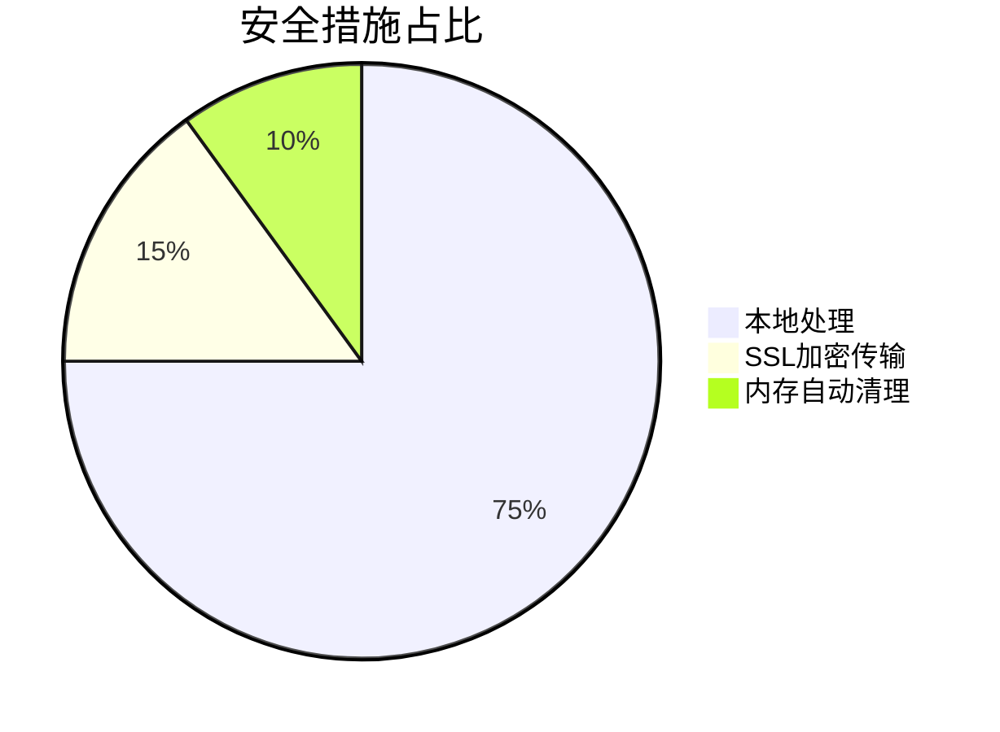

在数据传输和存储过程中，Base64编码技术如同隐形的安全卫士，将二进制数据转化为可读字符格式。今天介绍的**[Base64在线工具](https://tools.cmdragon.cn/zh/apps/base64-tool)**
，正是为开发者和普通用户打造的零门槛高效解决方案。

### 🔍 工具核心功能解析

1. **文本智能转换**
    - 直接粘贴文本内容，实时生成Base64编码
    - 解码时自动识别标准Base64/URL安全编码格式
    - 支持UTF-8/ASCII等多字符集处理

2. **文件高效处理**（<50MB）
   ```mermaid
   graph LR
   A[上传文件] --> B[自动编码]
   C[下载结果] --> D[复制到剪贴板]
   ```
   支持图片/文档/音频等常见文件格式的批量编码，特别适用于：
    - 网页内嵌图片资源
    - API传输二进制数据
    - 邮件附件编码

3. **URL安全模式**  
   自动替换`+/`为`-_`字符，完美适配URL传输场景：
   ```javascript
   // 标准编码
   dGV4dA== → 无法直接用于URL
   // 安全编码
   dGV4dA → 可直接嵌入链接
   ```

4. **图片可视化预览**  
   解码Base64图片时自动渲染预览，避免人工校验错误：
   ```
   data:image/png;base64,iVBORw0KGgoAAAANSUhEUg...
   ```

### 🚀 五大使用场景实战

1. **网页开发优化**  
   将小图标转为Base64减少HTTP请求：
   ```css
   .icon {
     background: url(data:image/svg+xml;base64,PHN2Zy...);
   }
   ```

2. **API数据传输**  
   避免二进制传输错误：
   ```json
   {
     "file": "UEsDBBQACAgIAJx...BASE64_CONTENT"
   }
   ```

3. **敏感信息模糊化**  
   临时隐藏关键信息：
   ```
   原始：API_KEY=ak_9xYzZq12 
   编码：QVBJX0tFWT1ha185eFl6WnExMg==
   ```

4. **电子邮件附件**  
   解决特殊字符导致的邮件系统过滤问题

5. **数据库存储**  
   兼容性存储二进制数据

### 📱 操作指南（3步完成）

1. 访问 [https://tools.cmdragon.cn/zh/apps/base64-tool](https://tools.cmdragon.cn/zh/apps/base64-tool)
2. 选择模式：
    - 文本：直接输入内容
    - 文件：拖拽上传
3. 点击「编码」或「解码」按钮获取结果

> 💡 **专业提示**：使用`Ctrl+Enter`快捷键可快速触发转换操作

### 🛡️ 安全增强方案

针对敏感数据场景，工具提供二次防护：



## 免费好用的热门在线工具

- [CMDragon 在线工具 - 高级AI工具箱与开发者套件 | 免费好用的在线工具](https/tools.cmdragon.cn/zh)
- [应用商店 - 发现1000+提升效率与开发的AI工具和实用程序 | 免费好用的在线工具](https/tools.cmdragon.cn/zh/apps?category=trending)
- [CMDragon 更新日志 - 最新更新、功能与改进 | 免费好用的在线工具](https/tools.cmdragon.cn/zh/changelog)
- [支持我们 - 成为赞助者 | 免费好用的在线工具](https/tools.cmdragon.cn/zh/sponsor)
- [AI文本生成图像 - 应用商店 | 免费好用的在线工具](https/tools.cmdragon.cn/zh/apps/text-to-image-ai)
- [临时邮箱 - 应用商店 | 免费好用的在线工具](https/tools.cmdragon.cn/zh/apps/temp-email)
- [二维码解析器 - 应用商店 | 免费好用的在线工具](https/tools.cmdragon.cn/zh/apps/qrcode-parser)
- [文本转思维导图 - 应用商店 | 免费好用的在线工具](https/tools.cmdragon.cn/zh/apps/text-to-mindmap)
- [正则表达式可视化工具 - 应用商店 | 免费好用的在线工具](https/tools.cmdragon.cn/zh/apps/regex-visualizer)
- [文件隐写工具 - 应用商店 | 免费好用的在线工具](https/tools.cmdragon.cn/zh/apps/steganography-tool)
- [IPTV 频道探索器 - 应用商店 | 免费好用的在线工具](https/tools.cmdragon.cn/zh/apps/iptv-explorer)
- [快传 - 应用商店 | 免费好用的在线工具](https/tools.cmdragon.cn/zh/apps/snapdrop)
- [随机抽奖工具 - 应用商店 | 免费好用的在线工具](https/tools.cmdragon.cn/zh/apps/lucky-draw)
- [动漫场景查找器 - 应用商店 | 免费好用的在线工具](https/tools.cmdragon.cn/zh/apps/anime-scene-finder)
- [时间工具箱 - 应用商店 | 免费好用的在线工具](https/tools.cmdragon.cn/zh/apps/time-toolkit)
- [网速测试 - 应用商店 | 免费好用的在线工具](https/tools.cmdragon.cn/zh/apps/speed-test)
- [AI 智能抠图工具 - 应用商店 | 免费好用的在线工具](https/tools.cmdragon.cn/zh/apps/background-remover)
- [背景替换工具 - 应用商店 | 免费好用的在线工具](https/tools.cmdragon.cn/zh/apps/background-replacer)
- [艺术二维码生成器 - 应用商店 | 免费好用的在线工具](https/tools.cmdragon.cn/zh/apps/artistic-qrcode)
- [Open Graph 元标签生成器 - 应用商店 | 免费好用的在线工具](https/tools.cmdragon.cn/zh/apps/open-graph-generator)
- [图像对比工具 - 应用商店 | 免费好用的在线工具](https/tools.cmdragon.cn/zh/apps/image-comparison)
- [图片压缩专业版 - 应用商店 | 免费好用的在线工具](https/tools.cmdragon.cn/zh/apps/image-compressor)
- [密码生成器 - 应用商店 | 免费好用的在线工具](https/tools.cmdragon.cn/zh/apps/password-generator)
- [SVG优化器 - 应用商店 | 免费好用的在线工具](https/tools.cmdragon.cn/zh/apps/svg-optimizer)
- [调色板生成器 - 应用商店 | 免费好用的在线工具](https/tools.cmdragon.cn/zh/apps/color-palette)
- [在线节拍器 - 应用商店 | 免费好用的在线工具](https/tools.cmdragon.cn/zh/apps/online-metronome)
- [IP归属地查询 - 应用商店 | 免费好用的在线工具](https/tools.cmdragon.cn/zh/apps/ip-geolocation)
- [CSS网格布局生成器 - 应用商店 | 免费好用的在线工具](https/tools.cmdragon.cn/zh/apps/css-grid-layout)
- [邮箱验证工具 - 应用商店 | 免费好用的在线工具](https/tools.cmdragon.cn/zh/apps/email-validator)
- [书法练习字帖 - 应用商店 | 免费好用的在线工具](https/tools.cmdragon.cn/zh/apps/calligraphy-practice)
- [金融计算器套件 - 应用商店 | 免费好用的在线工具](https/tools.cmdragon.cn/zh/apps/finance-calculator-suite)
- [中国亲戚关系计算器 - 应用商店 | 免费好用的在线工具](https/tools.cmdragon.cn/zh/apps/chinese-kinship-calculator)
- [Protocol Buffer 工具箱 - 应用商店 | 免费好用的在线工具](https/tools.cmdragon.cn/zh/apps/protobuf-toolkit)
- [图片无损放大 - 应用商店 | 免费好用的在线工具](https/tools.cmdragon.cn/zh/apps/image-upscaler)
- [文本比较工具 - 应用商店 | 免费好用的在线工具](https/tools.cmdragon.cn/zh/apps/text-compare)
- [IP批量查询工具 - 应用商店 | 免费好用的在线工具](https/tools.cmdragon.cn/zh/apps/ip-batch-lookup)
- [域名查询工具 - 应用商店 | 免费好用的在线工具](https/tools.cmdragon.cn/zh/apps/domain-finder)
- [DNS工具箱 - 应用商店 | 免费好用的在线工具](https/tools.cmdragon.cn/zh/apps/dns-toolkit)
- [网站图标生成器 - 应用商店 | 免费好用的在线工具](https/tools.cmdragon.cn/zh/apps/favicon-generator)
- [XML Sitemap](https/tools.cmdragon.cn/sitemap_index.xml)