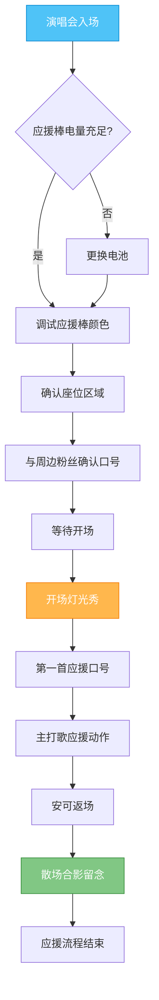

> 🔧 本文推荐工具：
> - 📦 [JSON可视化](https://tools.cmdragon.cn/zh/apps/json-visualizer) — JSON格式化/JSON编辑/JSON解析
> - 📝 [Markdown编辑器](https://tools.cmdragon.cn/zh/apps/markdown-editor) — Markdown编辑/在线Markdown/Markdown预览
> - 🔄 [Mermaid编辑器](https://tools.cmdragon.cn/zh/apps/mermaid-live-editor) — Mermaid/流程图/时序图/在线画图
>
> 无需下载安装，打开浏览器即用，完全免费！

📢 扫描二维码关注，获取更多开发者实用工具和热点解读！

---

## 一、今日热搜话题

2026年7月27日，一条引爆B站的内容冲上热搜榜：

- 🔥 **Papi酱生气了KPOP版** — B站热搜，热度572,097，parody视频播放量爆表

Papi酱经典"生气了"系列推出KPOP版本，将原版吐槽台词改编为KPOP追星场景，从偶像打歌舞台到粉丝应援口号，全程爆笑。开发者们也按捺不住了——追星的同时，开始用开发工具整理追星数据、写追星笔记、画偶像应援流程图。今天就用3个免费在线开发者工具，让追星也能写代码！

---

## 二、热点详解

### 2.1 Papi酱生气了KPOP版

| 维度 | 详情 |
|------|------|
| **事件** | Papi酱经典"生气了"系列推出KPOP版parody，登录B站后迅速爆火 |
| **核心内容** | 将原版"我对xx生气了"台词改编为KPOP追星场景：偶像打歌、粉丝应援、回归舞台、签售排队等槽点全开 |
| **亮点** | KPOP饭圈术语精准还原，"我对回归期生气了""我对打歌一位生气了"等金句刷屏弹幕 |
| **热度** | B站热搜热度572,097，弹幕互动量超百万，二创视频持续涌现 |
| **意义** | 以幽默方式呈现KPOP文化在中国的传播力，也反映出开发者群体中的追星热情 |
| **用户反应** | B站弹幕"笑到缺氧""这就是追星人的真实写照"，不少程序员发动态"原来我也可以用代码追星" |

---

## 三、JSON可视化 — 整理追星数据

🔗 [立即使用JSON可视化](https://tools.cmdragon.cn/zh/apps/json-visualizer)

### 3步使用流程

1. **粘贴JSON数据**：将偶像信息、专辑列表、回归日程等JSON数据粘贴到编辑区
2. **格式化解析**：点击"格式化"按钮，自动美化JSON结构，展开/折叠节点
3. **可视化查看**：以树形结构展示数据，支持搜索、复制路径、导出整理后的JSON

### 6个使用场景

| 序号 | 使用场景 | 说明 |
|------|----------|------|
| 1 | 整理偶像专辑数据 | 把多张专辑的发行日期、主打歌、销量整理成JSON，结构化查看 |
| 2 | 解析API返回数据 | 调用追星网站API获取偶像行程，用工具格式化查看JSON响应 |
| 3 | 整理回归日程表 | 把未来3个月的回归日期、打歌节目、签售会整理成JSON一览 |
| 4 | 应援物清单管理 | 用JSON记录应援棒、应援色、应援口号等饭圈资料 |
| 5 | 团体成员信息整理 | KPOP团体成员众多，用JSON存储姓名、出生日期、队内担当等 |
| 6 | 票务订单数据核对 | 演唱会抢票后导出订单JSON，核对场次、座位、价格信息 |

### 6个进阶技巧

| 序号 | 进阶技巧 | 说明 |
|------|----------|------|
| 1 | 嵌套数据折叠查看 | 大型JSON嵌套层级深，一键折叠非关键节点，聚焦核心信息 |
| 2 | 路径复制提取 | 复制某个字段的JSONPath，方便在代码中直接引用 |
| 3 | 数据校验纠错 | 检测JSON语法错误位置，比如漏逗号、引号不匹配等 |
| 4 | 多份数据对比 | 把两组JSON（如不同专辑信息）分别格式化，并排对比关键字段 |
| 5 | 导出整理后数据 | 将压缩的JSON一键格式化后导出，方便保存到追星笔记中 |
| 6 | 转换为表格视图 | 部分工具支持JSON转表格，更适合查看结构化的偶像信息列表 |

### 实例演示

**场景**：整理某KPOP团体回归专辑的JSON数据

1. 打开JSON可视化工具，粘贴原始JSON：

```json
{"album":{"title":"LOVE DIVE","release_date":"2026-08-15","title_track":"Dive","tracks":["Intro","Dive","Ocean","Coral","Reef","Outro"],"members":[{"name":"Kim","role":"Leader","vocal":"Main"},{"name":"Lee","role":"Vocal","vocal":"Lead"},{"name":"Park","role":"Rapper","vocal":"Sub"}],"sales":{"first_week":1500000,"total":2300000}}}
```

2. 点击"格式化"按钮，结果如下：

```json
{
  "album": {
    "title": "LOVE DIVE",
    "release_date": "2026-08-15",
    "title_track": "Dive",
    "tracks": [
      "Intro",
      "Dive",
      "Ocean",
      "Coral",
      "Reef",
      "Outro"
    ],
    "members": [
      {
        "name": "Kim",
        "role": "Leader",
        "vocal": "Main"
      },
      {
        "name": "Lee",
        "role": "Vocal",
        "vocal": "Lead"
      },
      {
        "name": "Park",
        "role": "Rapper",
        "vocal": "Sub"
      }
    ],
    "sales": {
      "first_week": 1500000,
      "total": 2300000
    }
  }
}
```

3. 折叠 `tracks` 节点，聚焦查看 `members` 信息，复制 Kim 的路径 `album.members[0].name` 备用
4. 导出整理后的JSON保存到追星笔记

> 💡 Papi酱生气了KPOP版里吐槽"我对专辑销量统计生气了"，用JSON可视化，销量数据一目了然，再也不会算错！

---

## 四、Markdown编辑器 — 写追星笔记

🔗 [立即使用Markdown编辑器](https://tools.cmdragon.cn/zh/apps/markdown-editor)

### 3步使用流程

1. **左侧编辑区输入内容**：使用Markdown语法编写追星笔记，支持标题、列表、表格、图片
2. **右侧实时预览**：边写边看渲染效果，所见即所得
3. **导出保存**：支持导出HTML、PDF或复制Markdown源码，保存到本地或博客

### 6个使用场景

| 序号 | 使用场景 | 说明 |
|------|----------|------|
| 1 | 写追星日记 | 每天用Markdown记录追星日常，结构化存储图文内容 |
| 2 | 整理偶像档案 | 用标题、表格、列表整理偶像的基本信息、作品年表 |
| 3 | 撰写回归分析 | 回归舞台后写舞美、编曲、舞蹈点评，支持插入截图 |
| 4 | 制作打榜攻略 | 用Markdown编写打榜教程，分享给同好粉丝 |
| 5 | 记录演唱会心得 | 演唱会观后感整理，支持引用歌词、插入现场图 |
| 6 | 写应援口号手册 | 整理不同场合的应援口号，方便打印随身携带 |

### 6个进阶技巧

| 序号 | 进阶技巧 | 说明 |
|------|----------|------|
| 1 | 代码块嵌入JSON | 在Markdown中嵌入JSON代码块，结合追星数据展示 |
| 2 | 表格美化排版 | 用Markdown表格制作专辑销量对比表、回归日程表 |
| 3 | 图片与链接混排 | 插入偶像图片超链接，点击跳转官方MV页面 |
| 4 | 锚点跳转目录 | 长篇追星笔记添加目录锚点，快速跳转到对应章节 |
| 5 | 任务清单追踪 | 用 `- [ ]` 语法制作"待完成的追星事项"清单 |
| 6 | 主题样式切换 | 切换不同预览主题（GitHub风、暗黑风），适合截图分享 |

### 实例演示

**场景**：撰写某KPOP团体回归追星笔记

1. 打开Markdown编辑器，在左侧输入以下内容：

```markdown
# LOVE DIVE 回归追星笔记

## 基本信息表

| 项目 | 内容 |
|------|------|
| 团体名称 | OCEAN |
| 回归日期 | 2026-08-15 |
| 主打歌 | Dive |
| 专辑类型 | 迷你3辑 |
| 一周销量 | 1,500,000 |

## 应援口号

- **Dive! Dive! Ocean forever!**
- **蓝色海洋，与你同行！**

## 待办事项清单

- [x] 购买数字专辑
- [x] 学习Dive应援歌词
- [ ] 参加8月20日签售会
- [ ] 制作应援手幅

## 数据代码块

\`\`\`json
{
  "album": "LOVE DIVE",
  "first_week_sales": 1500000
}
\`\`\`
```

2. 右侧实时预览渲染效果，标题加粗、表格对齐、清单带勾选框
3. 切换为"暗黑主题"，截图保存为追星壁纸素材
4. 点击"导出HTML"，生成可分享的网页笔记

> 💡 Papi酱生气了KPOP版里吐槽"应援口号背不下来"，用Markdown编辑器整理一份手册，随时随地查阅，再也不会喊错！

---

## 五、Mermaid编辑器 — 画偶像应援流程图

🔗 [立即使用Mermaid编辑器](https://tools.cmdragon.cn/zh/apps/mermaid-live-editor)

### 3步使用流程

1. **编写Mermaid代码**：在左侧编辑区使用Mermaid语法编写流程图、时序图、甘特图
2. **实时渲染预览**：右侧实时显示图形效果，修改即生效
3. **导出图片**：导出PNG、SVG或分享链接，保存到追星文档

### 6个使用场景

| 序号 | 使用场景 | 说明 |
|------|----------|------|
| 1 | 画应援流程图 | 用flowchart画出演唱会应援完整流程：入场→应援棒调试→口号喊起 |
| 2 | 绘制回归时序图 | 用sequenceDiagram画偶像回归舞台的各方互动时序 |
| 3 | 制作打歌日程甘特图 | 用gantt图规划一周打歌节目时间安排 |
| 4 | 整理团体关系图 | 用graph画成员关系图，标出队内担当、CP组合等 |
| 5 | 抢票决策流程图 | 用flowchart画演唱会抢票的决策路径，避免错过场次 |
| 6 | 饭圈组织架构图 | 用graph画粉丝后援会的组织架构与职能分工 |

### 6个进阶技巧

| 序号 | 进阶技巧 | 说明 |
|------|----------|------|
| 1 | 自定义节点样式 | 给重要节点设置不同颜色，比如主打歌节点高亮显示 |
| 2 | 子图分组归类 | 用subgraph将流程分组，比如"入场准备""演出过程""散场收尾" |
| 3 | 链接注释标注 | 给关键节点添加备注，说明注意事项 |
| 4 | 状态图表达 | 用stateDiagram画偶像的活动状态切换：训练→打歌→休息→回归 |
| 5 | 饼图占比分析 | 用pie chart分析专辑销量在不同渠道的占比 |
| 6 | 时序图泳道 | 用sequenceDiagram的泳道区分偶像、粉丝、经纪公司的互动 |

### 实例演示

**场景**：绘制演唱会应援完整流程图

1. 打开Mermaid编辑器，在左侧输入以下代码：



2. 右侧实时渲染出流程图：从入场到散场共13个节点，包含判断分支与高亮节点
3. 点击"导出PNG"，保存为追星攻略配图
4. 复制分享链接，发到粉丝群里供同好参考

> 💡 Papi酱生气了KPOP版里吐槽"应援流程乱成一锅粥"，用Mermaid画流程图，每一步清清楚楚，再也不怕错过关键时刻！

---

## 六、3个工具组合 — JSON+Markdown+Mermaid一站式搞定

面对KPOP追星信息爆炸，3个工具组合使用，5步完成全方位追星知识库搭建：

| 步骤 | 操作 | 工具 | 目的 |
|------|------|------|------|
| **第1步** | 整理偶像数据 | JSON可视化 | 将专辑、成员、销量等数据格式化结构存储 |
| **第2步** | 撰写追星笔记 | Markdown编辑器 | 用Markdown语法整理图文并茂的追星笔记 |
| **第3步** | 嵌入JSON代码块 | Markdown编辑器 | 在笔记中嵌入整理好的JSON数据，信息更立体 |
| **第4步** | 绘制应援流程图 | Mermaid编辑器 | 用流程图、时序图可视化追星相关流程 |
| **第5步** | 整合导出分享 | 三者结合 | 将Mermaid图导出图片插入Markdown，配合JSON数据导出完整追星知识库 |

**综合实例**：

追星族小张要为偶像"LOVE DIVE"回归建立完整知识库：

- 📦 JSON可视化：整理专辑JSON数据，格式化后复制
- 📝 Markdown编辑器：新建"LOVE DIVE回归笔记"，粘贴JSON代码块
- 🔄 Mermaid编辑器：画演唱会应援流程图，导出PNG图片
- 📝 Markdown编辑器：在笔记中插入流程图图片，撰写应援攻略文字
- ✅ 最终成果：一份集数据、文字、流程图于一体的追星知识库，可导出HTML分享给同好

---

## 七、为什么需要这些开发者工具

### 不用工具 vs 用工具对比

| 对比维度 | 不用工具 | 用工具 |
|----------|----------|--------|
| **追星数据整理** | 信息散落在聊天记录、便签，查找困难 | JSON结构化存储，一键检索关键字段 |
| **追星笔记撰写** | Word排版繁琐，图文混排不灵活 | Markdown轻量级写作，所见即所得 |
| **流程图绘制** | Visio笨重，学习成本高 | Mermaid语法简洁，代码即图形 |
| **多源数据整合** | 数据、文字、图表分散，难以统一 | JSON+Markdown+Mermaid一站式整合 |
| **协作分享** | 文件格式不统一，协作困难 | Markdown纯文本易分享，Mermaid链接可协作 |
| **更新维护** | 修改一处需多处同步 | 修改Markdown源码，整体重渲染 |
| **版本管理** | 历史版本无法追溯 | 纯文本可纳入Git版本控制 |
| **学习成本** | 各种工具各学一套 | 三大工具语法简单，开发者1小时入门 |

---

## 八、更多开发者工具推荐

| 序号 | 工具名称 | 功能说明 | 链接 |
|------|----------|----------|------|
| 1 | JSON可视化 | JSON格式化/JSON编辑/JSON解析 | [立即使用](https://tools.cmdragon.cn/zh/apps/json-visualizer) |
| 2 | Markdown编辑器 | Markdown编辑/在线Markdown/Markdown预览 | [立即使用](https://tools.cmdragon.cn/zh/apps/markdown-editor) |
| 3 | Mermaid编辑器 | Mermaid/流程图/时序图/在线画图 | [立即使用](https://tools.cmdragon.cn/zh/apps/mermaid-live-editor) |
| 4 | 正则表达式测试 | 正则匹配/替换/调试 | [立即使用](https://tools.cmdragon.cn/zh/apps/regex-tester) |
| 5 | Base64编解码 | 编码/解码/Base64转换 | [立即使用](https://tools.cmdragon.cn/zh/apps/base64) |
| 6 | URL编解码 | URL编码/解码/转义 | [立即使用](https://tools.cmdragon.cn/zh/apps/url-encoder) |
| 7 | 时间戳转换 | Unix时间戳/日期互转 | [立即使用](https://tools.cmdragon.cn/zh/apps/timestamp-converter) |
| 8 | 二维码生成 | 文本/链接转二维码 | [立即使用](https://tools.cmdragon.cn/zh/apps/qrcode-generator) |

---

## 九、更多免费工具推荐

| 工具分类 | 推荐工具 | 链接 |
|----------|----------|------|
| 🖼️ 图片工具 | 图片压缩/格式转换/水印添加 | [立即使用](https://tools.cmdragon.cn/zh/apps/image-compressor) |
| 📝 文本工具 | 字数统计/文本对比/大小写转换 | [立即使用](https://tools.cmdragon.cn/zh/apps/word-counter) |
| 🔐 加密工具 | 密码生成/哈希计算/Base64编解码 | [立即使用](https://tools.cmdragon.cn/zh/apps/password-generator) |
| 🎨 颜色工具 | 颜色选择器/格式转换/调色板 | [立即使用](https://tools.cmdragon.cn/zh/apps/color-picker) |
| 📊 编码转换 | URL编解码/Unicode转换/JSON格式化 | [立即使用](https://tools.cmdragon.cn/zh/apps/url-encoder) |

---

## 总结

Papi酱生气了KPOP版在B站爆火，热度突破57万！开发者也追星，追星的同时也可以用开发者工具整理数据、写笔记、画流程图，让追星更有条理、更有乐趣。

3个免费在线开发者工具帮你一站式搞定：

- 📦 **JSON可视化** — 整理偶像专辑、成员、销量等结构化数据
- 📝 **Markdown编辑器** — 撰写追星笔记、应援攻略、回归点评
- 🔄 **Mermaid编辑器** — 画应援流程图、回归时序图、打歌甘特图

全部免费、无需下载、打开浏览器即用！

📢 扫描二维码关注，获取更多实用工具和开发者热点解读！

---

<details>
<summary>📖 往期文章归档</summary>

- [AI趋势2026：Kimi K3+文字生成图片+小红书歌词](https://blog.cmdragon.cn/posts/ai-trend-2026-kimi-k3-text-to-image-xiaohongshu-lyrics/)
- [成都汽水音乐节2026歌词创作+Strudel音乐编程](https://blog.cmdragon.cn/posts/chengdu-qishui-music-festival-2026-lyrics-strudel/)
- [世界人工智能大会2026+文字生成图片+小红书歌词](https://blog.cmdragon.cn/posts/world-ai-conference-2026-text-to-image-xiaohongshu-lyrics/)
- [朋友圈vs微博差异2026+图片工具](https://blog.cmdragon.cn/posts/moments-weibo-difference-2026-image-tools/)
- [抖音生日祝福2026+视频下载+GIF制作](https://blog.cmdragon.cn/posts/douyin-birthday-blessings-2026-video-downloader-gif/)
- [豆包虚拟宠物2026+猫狗图库](https://blog.cmdragon.cn/posts/doubao-virtual-pets-2026-dog-cat-gallery/)
- [高考录取通知书2026+小红书简历](https://blog.cmdragon.cn/posts/gaokao-admission-notice-2026-xiaohongshu-resume/)
- [个人贷款新规8月1日起施行+理财王大赛S2揭晓3个免费计算工具](https://blog.cmdragon.cn/posts/loan-new-regulation-finance-king-2026-finance-tax-bmi/)

</details>

<details>
<summary>🛠️ 免费好用的热门在线工具</summary>

- 📦 [JSON可视化](https://tools.cmdragon.cn/zh/apps/json-visualizer) — JSON格式化/JSON编辑/JSON解析
- 📝 [Markdown编辑器](https://tools.cmdragon.cn/zh/apps/markdown-editor) — Markdown编辑/在线Markdown/Markdown预览
- 🔄 [Mermaid编辑器](https://tools.cmdragon.cn/zh/apps/mermaid-live-editor) — Mermaid/流程图/时序图/在线画图
- 🖼️ [图片压缩工具](https://tools.cmdragon.cn/zh/apps/image-compressor) — 图片压缩/格式转换
- 📝 [字数统计工具](https://tools.cmdragon.cn/zh/apps/word-counter) — 字数统计/文本对比
- 🔐 [密码生成器](https://tools.cmdragon.cn/zh/apps/password-generator) — 密码生成/哈希计算
- 🎨 [颜色选择器](https://tools.cmdragon.cn/zh/apps/color-picker) — 颜色选择/格式转换
- 📊 [URL编解码](https://tools.cmdragon.cn/zh/apps/url-encoder) — URL编解码/Unicode转换

</details>
