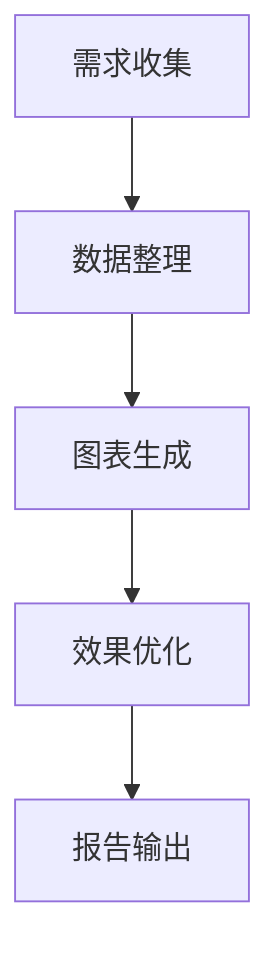
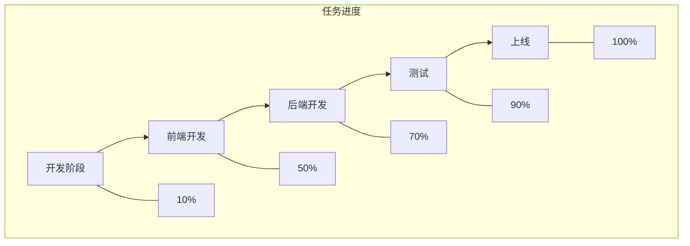

在数据处理与可视化的场景中，将表格数据转化为直观的图表是提升信息传递效率的关键步骤。无论是项目管理中的任务进度表格、数据分析中的统计结果、还是技术文档里的流程说明，当我们需要让“表格数据”变得更具可读性和展示性时，一款能直接将表格数据（尤其是支持
`graph td`格式）生成图表的工具就显得尤为重要。这类工具能省略手动排版、格式转换的繁琐流程，让数据从“静态表格”跃变为“动态图表”，从而更清晰地传达复杂信息。

### 为什么需要专门的“表格数据生成图表”工具？

传统方式中，用户可能尝试用Excel插入图表、PPT绘制图形，或者用在线工具如Google Charts手动转化数据，但这些方法往往存在局限性：

- **手动操作复杂**：Excel生成图表需重复调整数据区域、选择图表类型、设置样式，耗时且易出错；
- **格式兼容性低**：若表格数据包含特殊结构（如嵌套表格、多层级td定义），传统工具难以智能识别并转化为可视化图表；
- **实时性不足**：无法边修改表格数据边预览图表效果，导致最终呈现与预期不符。

而专门针对“表格数据生成图表”的工具，通常基于结构化语法（如mermaid的流程图语法），能直接将`graph td`
这类表格描述转化为图表，实现“语法即图表”的高效转化。

### 推荐工具：mermaid-live-editor，轻松实现`graph td`数据生成图表

在众多支持表格数据转图表的工具中，**mermaid-live-editor
**（[https://tools.cmdragon.cn/apps/mermaid-live-editor](https://tools.cmdragon.cn/apps/mermaid-live-editor)）凭借对
`graph td`语法的原生支持、实时编辑预览能力和多格式导出功能，成为处理表格数据生成图表的优选工具。其核心优势在于：

#### 1. 支持`graph td`语法，精准匹配表格数据生成需求

`graph td`是mermaid语法中用于定义**横向流程表格**的核心结构，常用于描述具有顺序关系的流程（如甘特图、任务分配表、步骤流程图）。用户只需在mermaid-live-editor中输入包含
`graph td`的表格数据，即可自动生成对应的可视化图表。例如，输入以下`graph td`格式的代码：

工具会立即渲染出横向流程图，表格中的每个节点（如A、B、C等）自动对应为图表中的矩形框，箭头表示步骤顺序，直观呈现数据关系。这比手动绘制流程图节省大量时间，尤其适合技术文档、项目管理等需要快速梳理流程的场景。

#### 2. 实时编辑+多格式导出，满足多场景需求

mermaid-live-editor是**在线免安装工具**，打开链接即可直接使用，无需配置环境。用户在左侧输入框编写`graph td`或其他mermaid语法（如
`flowchart`、`gantt`、`pie`图表），右侧实时预览区会即时更新图表效果，还支持**实时拖拽调整节点顺序**、**
修改样式（颜色、字体、箭头）**等个性化设置。

生成图表后，可一键导出为PNG、SVG等格式，方便嵌入Word、PPT、Markdown文档，或分享至博客、项目管理平台（如GitHub），解决了传统工具“生成-导出-调整”的多步骤痛点。

#### 3. 轻量语法+无学习门槛，快速上手

mermaid-live-editor的语法规则简单直观，即使是零基础用户，只需理解“节点定义（A[内容]）+ 关系描述（-->）+
格式排版（td表格）”的基本结构，就能快速上手。例如，用`graph td`描述一个包含“任务名称”“负责人”“进度”的表格数据：

这样就能在图表中同时展示流程和进度数据，既清晰又节省可视化成本。

### 总结：选择工具时的核心考量

在处理“graph td表格数据生成图表”需求时，我们更需要的是**语法友好、实时预览、跨场景兼容**的工具。mermaid-live-editor通过支持
`graph td`等表格数据语法，将静态数据转化为动态图表，并提供全流程的编辑-预览-导出体验，完美适配项目管理、技术文档、数据分析等多场景。

如果你正面临表格数据可视化的效率问题，不妨试试[graph td](https://tools.cmdragon.cn/apps/mermaid-live-editor)
这款工具，只需打开链接开始编写语法，即可一键生成专业图表，让数据表达更高效、更直观。
