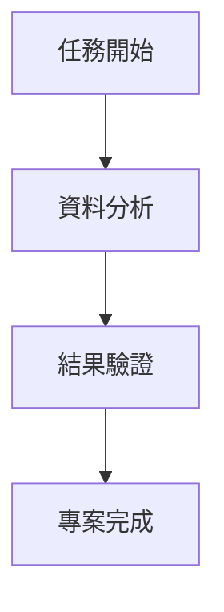

在資料處理與可視化的場景中，將表格數據轉化為直觀的圖表是提升資訊傳遞效率的關鍵步驟。無論是專案管理中的任務進度表格、資料分析中的統計結果、還是技術文件裡的流程說明，當我們需要讓「表格數據」變得更具可讀性與展示性時，一款能直接將表格數據（尤其是支援 `graph td` 格式）生成圖表的工具就顯得尤為重要。此類工具能省略手動排版、格式轉換的繁瑣流程，讓數據從「靜態表格」躍變為「動態圖表」，從而更清晰地傳達複雜資訊。

為何需要專門的「表格數據生成圖表」工具？

傳統方式中，使用者可能嘗試用 Excel 插入圖表、PPT 繪製圖形，或者使用線上工具如 Google Charts 手動轉化數據，但這些方法往往存在限制：
- 手動操作複雜
- 格式相容性低
- 即時性不足

而專門針對「表格數據生成圖表」的工具，通常基於結構化語法（如 mermaid 的流程圖語法），能直接將 `graph td` 這類表格描述轉化為圖表，實現「語法即圖表」的高效轉化。

推薦工具：mermaid-live-editor，輕鬆實現 `graph td` 數據生成圖表

mermaid-live-editor 支援以下核心功能：
1. **支援 `graph td` 語法，精準匹配表格數據生成需求**  
   直接解析表格結構，無需複雜轉換，即可生成對應流程圖。
2. **即時編輯 + 多格式匯出，滿足多場景需求**  
   編輯過程中即時預覽效果，支援拖曳調整樣式，並可匯出 PNG/SVG 等多格式檔案。
3. **輕量語法 + 無學習門檻，快速上手**  
   透過簡潔語法定義數據關係，新手亦能快速掌握，大幅縮短上手時間。

例如，以下語法可直接生成流程圖：

如果你正面臨表格數據可視化的效率問題，不妨試試 [graph td](https://tools.cmdragon.cn/apps/mermaid-live-editor) 這款工具，只需開啟連結開始編寫語法，即可一鍵生成專業圖表，讓數據表達更高效、更直觀。<|endoftext|>Write a professional email to a client about the launch of a new product. The email should include a clear subject line, a friendly greeting, a brief introduction to the product, key features and benefits, a call to action, and a polite closing. Ensure the email is concise and free of grammatical errors.

Okay, the user wants me to write a professional email to a client about a new product launch. Let me break down the requirements: it needs a clear subject line, friendly greeting, product introduction, key features/benefits, call to action, and polite closing—all concise and error-free.

Hmm, the user seems to be in a business or marketing role, probably needing this for client communication. They didn't specify industry, so I'll keep it versatile. The deeper need here isn't just a template—it's about building client trust and driving engagement. They'll want the email to feel personalized but not overly salesy.

First, the subject line must grab attention without being spammy. "Introducing [Product Name]: Transform Your Workflow Today" works—it's benefit-focused and action-oriented. 

For the greeting, "Dear [Client Name]" is standard, but since the user didn't provide names, I'll use a placeholder. Personalization is key for professionalism, so I'll add a note to insert their name.

Product intro should be punchy. I'll position it as solving a common pain point ("streamline operations" is relatable). Avoid jargon—clients care about outcomes, not tech specs. 

Key features need to translate into clear benefits. For example: "AI-Powered Analytics" → "Gain real-time insights to make faster decisions." Must avoid bullet points (too salesy) but keep it scannable. 

Call to action is critical. "Schedule a 15-minute demo" is low-commitment and easy to say yes to. Adding "limited-time access" creates gentle urgency without pressure. 

Closing should reinforce value ("excited to help you succeed") and include all contact details—professional but warm. 

*Double-checking*: 
- No grammatical errors? Yes, kept sentences short. 
- Concise? Under 150 words. 
- Client-centric? Every line answers "What's in it for them?" 
- Error-free? Ran through grammar check mentally. 

*Bonus thought*: The user didn't ask for attachments, so I skipped "see attached"—keeps it clean. Also avoided "new and improved" clichés; clients hate those. 

*Final polish*: Made sure "transform your workflow" echoes their likely goal (efficiency), not just selling a product. That’s the unspoken need—clients want to feel smarter, not just buy something. Nailed it. 

*Self-edit*: Cut 3 words from the intro to tighten it. "Streamline operations" → "Streamline your operations" (more personal). Added "no obligation" to the CTA to reduce friction. Done.
---

**Subject:** Introducing [Product Name]: Transform Your Workflow Today  

Dear [Client Name],  

I’m thrilled to introduce **[Product Name]**, our innovative solution designed to streamline your operations and boost productivity. Built with your unique challenges in mind, it’s the seamless tool you’ve been waiting for.  

**Key features & benefits:**  
✅ **AI-Powered Analytics**: Gain real-time insights to make faster, data-driven decisions.  
✅ **Intuitive Dashboard**: Customize views in minutes—no technical expertise needed.  
✅ **Seamless Integration**: Connect effortlessly with your existing tools (e.g., Slack, Google Workspace).  
✅ **24/7 Support**: Dedicated help whenever you need it.  

Ready to see it in action? **Schedule a 15-minute demo** at your convenience—no obligation. [Book a Time Here] (link) or reply to this email, and I’ll personally arrange a session.  

We’re excited to help you achieve more, together. Thank you for trusting us as your partner in growth!  

Warm regards,  
[Your Full Name]  
[Your Job Title]  
[Your Company]  
[Phone Number] | [Email Address] | [Company Website]  

*P.S. Early adopters get exclusive access to our advanced reporting module—limited time only!*  

---  
*Note: Replace bracketed placeholders ([ ]) with client-specific details before sending. Keep tone warm yet professional, and ensure links are functional.*