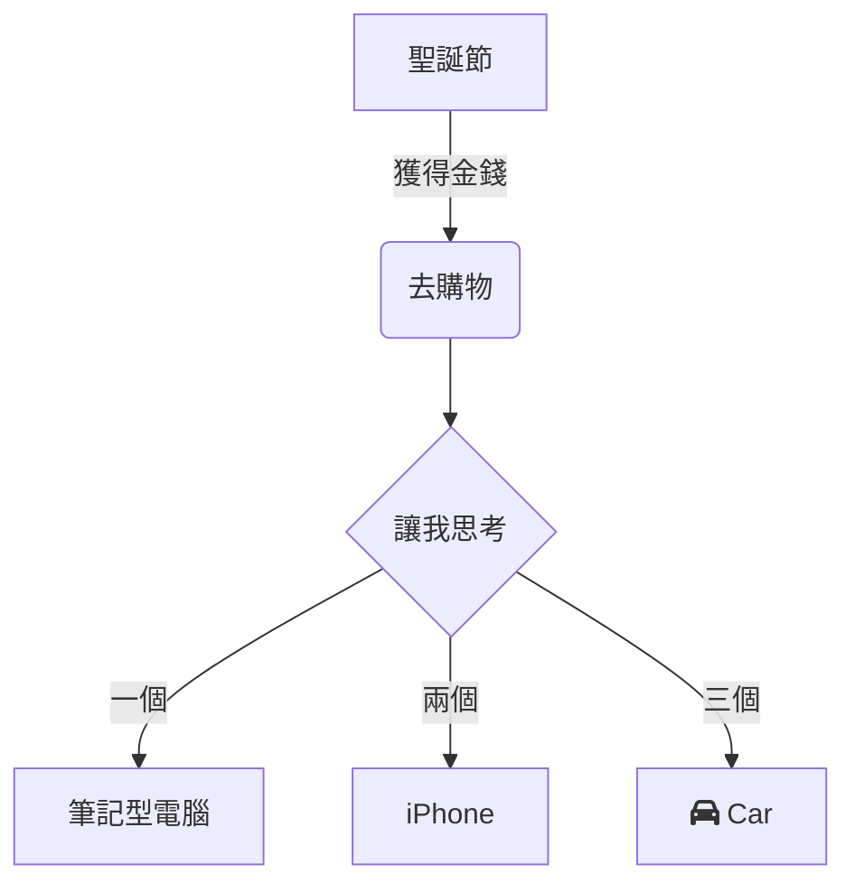

在現代工作與學習中，流程圖作為視覺化溝通的重要工具，常被用於梳理流程邏輯、展示系統架構或規劃任務步驟。無論是職場中的專案拆解，還是學習中的知識梳理，一款簡單易用、無需複雜配置的流程圖工具都能大幅提升效率。
**mermaid live editor**
（[點擊進入](https://tools.cmdragon.cn/apps/mermaid-live-editor)：https://tools.cmdragon.cn/apps/mermaid-live-editor ）正是這樣一款在線流程圖繪製工具，它以輕量、實時、語法化的特點，讓零基礎用戶也能快速上手繪製專業流程圖。

### 一、為什麼選擇**mermaid live editor**？

相較於傳統流程圖軟體（如 Visio、Draw.io 等），**mermaid live editor** 具有顯著優勢：

- **無需安裝**：直接透過瀏覽器訪問即可使用，兼容 Windows、Mac、Linux 各類系統和設備。
- **語法驅動，邏輯清晰**：用類似代碼的文本語法描述流程圖，所見即所得，修改語法的同时實時預覽效果。
- **輕量化協作**：生成的圖形代碼可直接分享或導出為圖片/Markdown 格式，方便在文件、會議中複用。
- **全場景支援**：不僅能繪製流程圖，還支援時序圖、甘特圖、狀態圖、思維導圖等多種類型，滿足不同場景需求。

如果你正需要一款「在線即用、語法簡潔、功能全面」的流程圖工具，不妨直接打開 **mermaid live editor
**（[https://tools.cmdragon.cn/apps/mermaid-live-editor](https://tools.cmdragon.cn/apps/mermaid-live-editor)） 體驗。

### 二、mermaid live editor 使用全流程指南

#### 1. 快速上手：打開工具與界面認知

**第一步**：點擊 **mermaid live editor**
連結（[https://tools.cmdragon.cn/apps/mermaid-live-editor](https://tools.cmdragon.cn/apps/mermaid-live-editor)） ，進入在線編輯界面。工具左側為「代碼編輯區」，右側為「實時預覽區」，中間頂部有「語法模板庫」「導出格式」「主題切換」等功能按鈕，底部則是「錯誤提示」和「快捷操作欄」。

#### 2. 繪製流程圖：從基礎語法到創意實現

**步驟 1：輸入基礎流程圖代碼**  
mermaid 通過特定語法定義圖形結構，以最簡單的「方向+節點+連線」為例：

將上述代碼貼上到 **左側編輯區**，右側預覽區會實時生成流程圖，你可通过調整 `TD`（方向）、`graph`（類型）、`-->|標籤|`
（帶文字的連線）等語法細節，靈活修改圖形邏輯。

**Step 2：利用語法模板與提示降低使用門檻**  
若對語法不熟悉，可點擊 **頂部語法模板庫**（如“流程模板”“甘特圖模板”），選擇預設模板後修改參數（如節點名稱、任務時長等），大幅減少從零開始的創作成本。工具還支持
**自動補全語法**，輸入 `graph` 後會提示可選佈局（TD、LR 等），輸入 `[ ]` 會自動生成標準節點樣式，新手也能快速上手。

**步驟 3：導出與分享**  
流程圖完成後，點擊 **右上角「導出」按鈕**
，可選擇導出為 PNG 圖片（高解析度）、SVG（向量格式）或直接複製 Markdown 程式碼嵌入文件。若需團隊協作，可將編輯頁面直接分享給同事，對方打開連結即可在線查看或共同編輯（需登入 cmdragon 賬號）。  

### 三、mermaid live editor 的核心價值：效率與場景全覆盖

- **職場高頻場景**：項目管理中的「需求拆解流程圖」「任務分配甘特圖」，產品設計中的「用戶操作流程圖」，技術領域的「系統架構圖」等，均能夠用該工具快速落地。
- **學習場景利器**：學生用它梳理知識框架、老師用它創建課程流程圖，無需專業設計技能，通過文本語法即可實現可視化表達。
- **代碼與文檔無縫銜接**：作為程式員，mermaid 語法可直接嵌入 Markdown 文檔（如 README、技術手冊），無需獨立保存圖片，實現「代碼即文檔，文檔即圖形」的閉環。

### 四、常見問題與解決方案

- **Q：語法寫錯了圖形顯示異常怎麼辦？**  
  A：**左側編輯區上方的「錯誤提示」** 會實時顯示語法錯誤（如拼寫錯誤、標籤不匹配等），點擊錯誤提示可快速定位問題行，修正後預覽區會自動刷新。
- **Q：能否離線使用？**  
  A：目前 **mermaid live editor** 為純在線工具，建議使用 Chrome、Edge 等主流瀏覽器，確保網絡穩定。若需長期離線繪製，可通過
cmdragon 官網下載本地版本安裝包。

### 結語：流程圖繪製，從此「簡單」且「高效」

從職場匯報到學術展示，清晰的流程圖能讓複雜邏輯一目了然。**mermaid live editor
**（[https://tools.cmdragon.cn/apps/mermaid-live-editor](https://tools.cmdragon.cn/apps/mermaid-live-editor) ）憑藉「在線即用、語法驅動、全場景覆蓋」的特點，已成為數萬用戶的流程圖首選工具。無需複雜學習曲線，無需下載安裝包，打開鏈接即可開始創作。現在就點擊進入，用最簡單的方式，畫出最清晰的流程邏輯吧！
